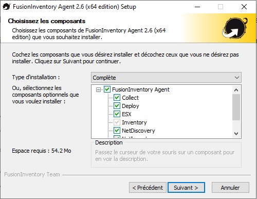

# :desktop_computer: Mise en place d'un poste client Windows 10 et remonter le poste client dans l’inventaire GLPI

> :bulb: Comme dit précédemment, une machine virtuelle a été installé comme client. 

> :bulb: Afin de réaliser cette partie, j'ai suivi le cours de OpenClassroom : https://openclassrooms.com/fr/courses/1730516-gerez-votre-parc-informatique-avec-glpi/5994176-installez-le-plugin-et-l-agent-fusioninventory#/id/r-6150440

## Installation et configuration de FusionInventory Agent

FusionInventory Agent s'installe sur les machines clients.

:bulb: Il permet de faire l'inventaire de notre parc informatique (il va donc afficher la machine client ayant installée l'agent)

Après avoir choisi la version correspondante à ma VM, on commence l'installation.

Il faut suivre les étapes d'installation jusqu'à ce qu'on arrive ici :



Il faut choisir une installation complète afin d'avoir tous les composants.

On continue les étapes (choisir le chemin d'installation), puis on arrive sur une étape importante :


C'est une étape très importante. Il faut donc mettre l'adresse comme ceci :

```txt
http://<adresse_ip_du_serveur>/glpi/plugins/fusioninventory/
```

Cela permet à l'agent fusionInventory d'envoyer son inventaire au serveur.

Une fois cette étape fait, il faut continuer en faisant une installation rapide.

On peut maintenant tester FusionInventory en ouvrant un navigateur web et en mettant dans l'adresse : `http://localhost:62354` ou `http://127.0.0.1:62354`.

On devrait arriver sur cette page :


On peut maintenant cliquer sur *force an inventory*, ce qui va envoyer l'inventaire.

Maintenant, on peut voir sur l'interface web de **GLPI**, dans la catégorie  *Administration > FusionInventory*, qu'il y a bien un Agent de déployé :


On peut aussi voir dans le sous-menu *Général > Gestion des agents*, qu'il y a bien l'agent déployé précédemment :


[<--- Ajout au serveur, d'un plugin de remontée de poste client...](./config_fusioninventory.md) | [Mise en place d'une sauvegarde de GLPI --->](./sauvegarde_glpi.md)

