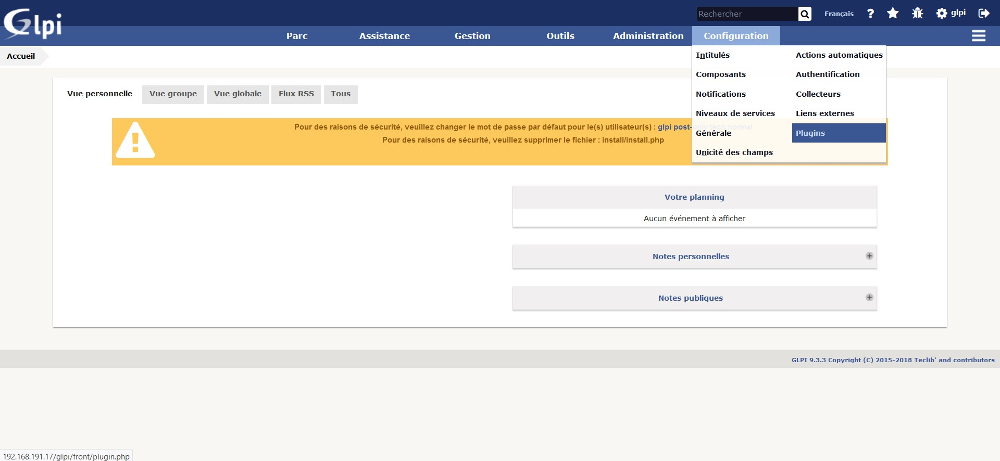
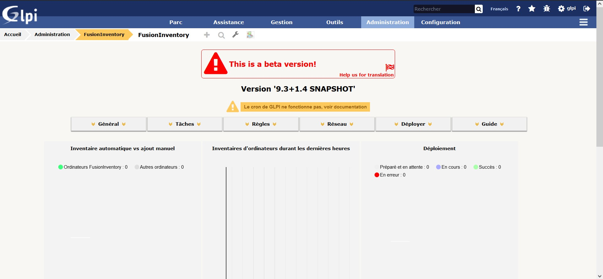
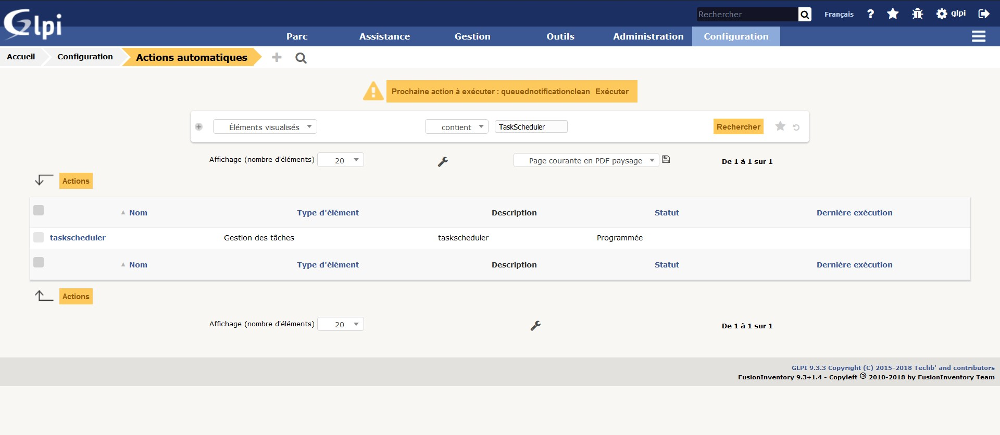

# :clipboard: Ajout au serveur, d'un plugin de remontée de poste client pour pouvoir réaliser l’inventaire du parc.

> :bulb: Afin de réaliser cette partie, j'ai suivi le cours suivant : https://openclassrooms.com/fr/courses/1730516-gerez-votre-parc-informatique-avec-glpi/5994176-installez-le-plugin-et-l-agent-fusioninventory

> :bulb: Pour exécuter les commandes suivantes, il faut soit se mettre en ``root``, soit ajouter `sudo` au début de chaque commande.

## :minidisc: Installer le plugin FusionInventory

Tout d'abord, il est important de savoir quelle version utiliser avec la version de GLPI. Pour ce faire, on peut regarder sur le site http://fusioninventory.org/

Après avoir regardé pour notre version de GLPI, on utilise la *version 9.3+1.4* de FusionInventory (la *version 9.3+1.3* n'existe plus).

On peut remettre à jour la liste des paquets :

```sh
apt-get update && apt-get upgrade
```

Puis on peut télécharger le plugin :

```sh
cd /usr/src
wget https://github.com/fusioninventory/fusioninventory-for-glpi/archive/glpi9.3+1.4.tar.gz
tar -zxvf glpi9.3+1.4.tar.gz -C /var/www/html/glpi/plugins 
```

Explication des lignes ci-dessus :
- La première commande nous permet d'aller dans le répertoire `usr/src`.
- La deuxième commande nous permet de récupérer le plugin fusionInventory.
- La troisième commande nous permet d'extraire l'archive précédemment récupérée.

Comme vu précédemment, il faut donner les droits au serveur :

```sh
chown -R www-data /var/www/html/glpi/plugins
```

Et afin d'éviter des erreurs avec GLPI, on va renommer le dossier du fusionInventory :

```sh
cd /var/www/html/glpi/plugins
mv fusioninventory-for-glpi-glpi9.3-1.4/ fusioninventory/
```

Maintenant, on peut retourner sur l'interface web, en utilisant l'utilisateur administrateur.


Ensuite, il faut aller dans *Configuration > Plugins*



On peut y retrouver le plugins FusionInventory qu'il faut installer en appuyant sur le boutons *Installer*.


Une fois l'installation terminé, on peut appuyer sur le bouton *Activer*.


## :minidisc: Configurer FusionInventory

Pour acceder au menu de FusionInventory, aller dans *Administration > FusionInventory*.



On va pouvoir régler le problème du ``crontab``. En effet, il est nécessaire, pour enlever l'erreur visible dans le menu, d'ajouter le fichier ``cron.php`` au [crontab](./definition#crontab) de Linux.

On reparlera du `crontab` plus en détail dans la partie [Mettre en place une sauvegarde de GLPI](./).

Pour faire ceci, on ouvre le *cron* avec :

```sh
crontab -u www-data -e
```
Puis on écrit :

```sh
*/1 * * * * /usr/bin/php5 /var/www/html/glpi/front/cron.php &>/dev/null
```
Une fois fait, pour que les modifications soient prise en compte, on redémarre le *cron* avec la ligne :

```sh
/etc/init.d/cron restart
```

Une fois relancer, on peut continuer la configuration sur l'interface web. On va donc dans *Configuration > Actions*.

Il faut y trouver l'action nommé ``taskscheduler`` et cliquer dessus.



Une fois sur le menu, on peut tout simplement cliquer sur le bouton *Executer*.


Et on aura donc régler le problème du `crontab`.

[<--- Configuration d'un outil de gestion de ticket](./config_glpi.md) | [Remonter le poste client dans l’inventaire GLPI --->](./config_fusioninv_agent.md)