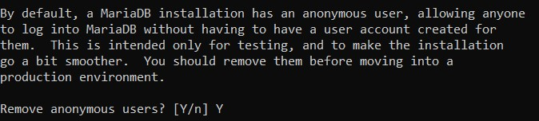
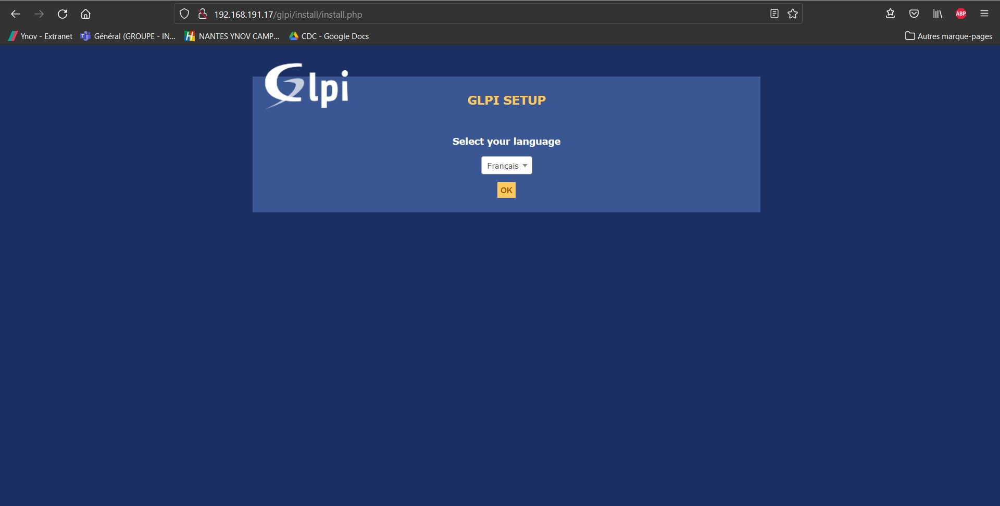

# :ticket: Configuration d'un outil de gestion de ticket

> :bulb: Afin de réaliser cette partie, j'ai suivi le cours suivant : https://openclassrooms.com/fr/courses/1730516-gerez-votre-parc-informatique-avec-glpi/5993816-installez-votre-serveur-glpi

> :bulb: Pour exécuter les commandes suivantes, il faut soit se mettre en ``root``, soit ajouter `sudo` au début de chaque commande.

## :floppy_disk: Les prérequis

Tout d'abord, il faut mettre à jour la liste des paquets

```sh
apt-get update && apt-get upgrade
```

Maintenant, on peut installer les outils nécessaire :

- installation de [Apache2](./definition.md#apache2) :
    ```sh
    apt-get install apache2 php libapache2-mod-php
    ```
- installation de [PHP](./definition.md#php) :
    ```sh
    apt-get install php-imap php-ldap php-curl php-xmlrpc php-gd php-mysql php-cas
    ```
- installation de [MariaDB](./definition.md#mariaDb) :
    ```sh
    apt-get install mariadb-server
    mysql_secure_installation
    ```
    Pour **MariaDB**, il y a plusieurs questions qui s'affiche lors de l'installation, il faut répondre "**Y**" à toutes.

    C'est ici que l'on va créer un utilisateur root pour **MariaDB**, et aussi supprimer l'utilsateur par défaut.

    

Il faut aussi installer quelques modules complémentaires pour GLPI :

Cette commande installe des modules pour un meilleur fonctionnement de GLPI (meilleure intéraction avec des technologies)

```sh
apt-get install apcupsd php-apcu
```

Ensuite, il faut redémarré les services *Apache2* et *MariaDB*:

(si jamais la deuxième ligne de la commande ne marche pas, remplacé `mysql` par `mariadb`)

```sh
/etc/init.d/apache2 restart
/etc/init.d/mysql restart
```
Maintenant, nous allons créer la base de données :

(Il faudra rentrer le mot de passe du compte root de MariaDB)

```sh
mysql -u root -p
```

> :bulb: MariaDB va donc ouvrir un **command prompt** (`MariaDB [(none)]>`) qui n'est plus celui de Debian. Les prochaines commandes sont comprise par le **prompt** de MariaDB.

```sh
MariaDB [(none)]> create database glpidb; 
MariaDB [(none)]> grant all privileges on glpidb.* to glpiuser@localhost identified by "votre-mot-de-passe";
MariaDB [(none)]> quit
```
Voici ce que font les commandes ci-dessus :
- La première commande va créer la base de données `glpidb`
- La deuxième commande donne les droits de cette base à l'utilisateur (qui est créé à ce moment là) `glpiuser` et défini le mot de passe. 
    :warning: Il faut changer "votre-mot-de-passe" par celui de votre choix.
- La dernière commande permet de quitter le *command prompt* de MariaDB.

Maintenant, pour plus de simplicité avec la *BDD*, on installera ``phpMyAdmin``, qui va vous permettre de gérer la base de données en interface graphique.

(Si jamais l'installation de PhpMyAdmin ne marche pas, il faut chercher un autre outils.)

```sh
apt-get install phpmyadmin
```

Un menu va s'ouvrir, il faut choisir *Apache2* puis répondre *NON* à la demande de création de ``db_common``.

Tout ce qu'on a fait jusque là, à permit de créer un serveur de type ***LAMP*** (Linux Apache MySQL PHP).

## :tickets: Installation et configuration de GLPI

L'installation de [GLPI](./definition.md#glpi) se fait en 2 temps, par ligne de commande puis par interface graphique.

Dans un premier temps, on va récupérer les **paquets GLPI** :
```sh
cd /usr/src/
wget https://github.com/glpi-project/glpi/releases/download/9.3.3/glpi-9.3.3.tgz
tar -xvzf glpi-9.3.3.tgz -C /var/www/html
```
> :bulb: Il existe une version 9.5, plus récente de GLPI, mais malheureusement, elle ne fonctionne pas avec l'outil FusionInventory.

Maintenant que nous avons récupérer les **paquets GLPI**, on peut donner les droits à notre serveur, d'intéragir avec eux.

```sh
chown -R www-data /var/www/html/glpi/
```

Maintenant, on peut passer à l'installation via l'interface graphique (web).

Pour y accéder, il faut ouvrir dans le navigateur, l'interface web se trouvant à l'adresse de `http://<adresse_ip_du_serveur>/glpi`.

> :warning: L'adresse Ipv4 utilisée ici, est différente de celle utilisée lors des test de ``ping`` (voir [plus haut](./main_page#electric_plug-configuration-réseau)). En effet, l'installation / configuration ont été fait sur un autre réseau.

Ici, se sera `http://192.168.191.17/glpi`, ce qui ouvrira :



Il faut choisir la langue puis cliquer sur *OK*.

Ensuite, il faut accepter la Licence, puis cliquer sur *Continuer*.


Puis, cliquer sur *Installer* :


La page suivante nous montre tous les paquets qui doivent être installer :


Comme on peut le voir, dans notre cas, il y a une erreur sur 2 paquets.

Pour régler ces erreurs, la plupart du temps, il faut installer le paquet comme ceci :

```sh
apt-get install php-<nom_du_paquet_manquant>
```

Dans notre cas donc, il faut faire :

```sh
apt-get install php-mbstring
apt-get install php-simplexml
```
> :bulb: Au moment d'appuyer sur le bouton *Réessayer*, il pourrait y avoir aucun changement. Pour ce faire, il faut recharger le serveur Apache2 soit en faisant : `sudo service apache2 restart` soit en refaisant la commande `/etc/init.d/apache2 restart`

Pour la dernière erreur, d'après le cours sur [OpenClassroom](https://openclassrooms.com/fr/courses/1730516-gerez-votre-parc-informatique-avec-glpi/5993816-installez-votre-serveur-glpi#/id/r-5994042) :

> Concernant la dernière erreur, c’est une alerte de sécurité qui informe qu’en tapant le nom des sous-répertoires dans l’URL du site, on a la possibilité de naviguer dans les fichiers via l’interface web ; ce qui est, vous vous en doutez, une faille de sécurité. Pour notre serveur d’essais, ça n’a pas d’importance, mais en production vous devrez verrouiller les sous-répertoires en y ajoutant un fichier .htaccess.

On peut donc appuyer sur *Continuer*.

Puis on arrive sur la page suivante, où il faut rentrer les informations comme ceci :
- serveur SQL : `localhost`
- utilisateur SQL : `glpiuser`
- mot de passe SQL : `<mot de passe vu précedemment>`


Après avoir cliquer sur *Continuer*, on arrive sur la page où il faut choisir la base de données. Il faut choisir celle qu'on a créé précédemment : ``glpidb``.

Puis on peut appuyer sur *Continuer* (:warning: il est important de ne pas appuyer plusieurs fois sur *Continuer* au risque de créer des problèmes).


Si tout est bon, on a cette page qui s'affiche : 


On peut appuyer sur *Continuer*.

Pour les étapes 4 et 5, ce ne sont pas des choix importants.

L'étape 6, en revanche, est importante car elle nous donne les identifiants et les mots de passe par défauts de GLPI.
Il faut donc tout garder : 


On peut donc maintenant se connecter à *GLPI* :


[<--- Mise en place d'une machine virtuelle et...](./config_réseaux.md) | [Plugin de remontée de poste client... --->](./config_fusioninventory.md)
