# :floppy_disk: TP n°1 :

## Sommaire du TP n°1 :

- [Mise en place d'une machine virtuelle et configuration des services réseaux](./main_page.md#desktop_computer-mise-en-place-dune-machine-virtuelle)
- [Configuration d'un outil de gestion de ticket](./main_page.md#Configuration-dun-outil-de-gestion-de-ticket)
- Ajout au serveur, d'un plugin de remontée de poste client pour pouvoir réaliser l’inventaire du parc 
- Mise en place d'un poste client Windows 10 et remonter le poste client dans l’inventaire GLPI
- Mise en place d'une sauvegarde de GLPI

## :desktop_computer: Mise en place d'une machine virtuelle et configuration des services réseaux

### Avant de commencer.

Tout d'abord, il faut installer une **VM serveur** (debian 11) et une **VM client** (windows 10).

Pour ce faire, on utilise (dans notre cas) l'outils **VMWare Workstation Player**

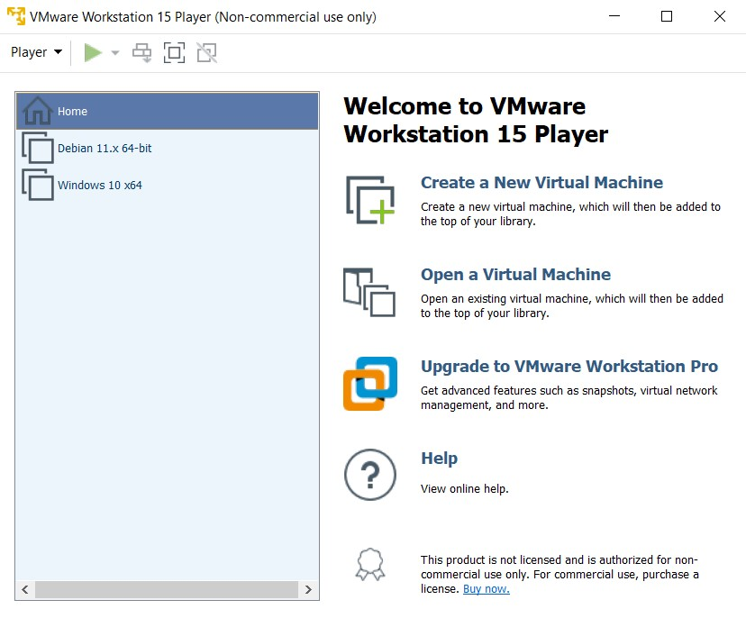

Comme on peut le voir, il y a bien 2 VMs d'installées.

### :electric_plug: Configuration réseau

Afin que les 2 machines virtuelles puissent communiquer entre elle, il va falloir configurer la partie réseau comme ceci :

Tout d'abord, il faut se rendre dans ***Manage > Virtual Machine Settings***

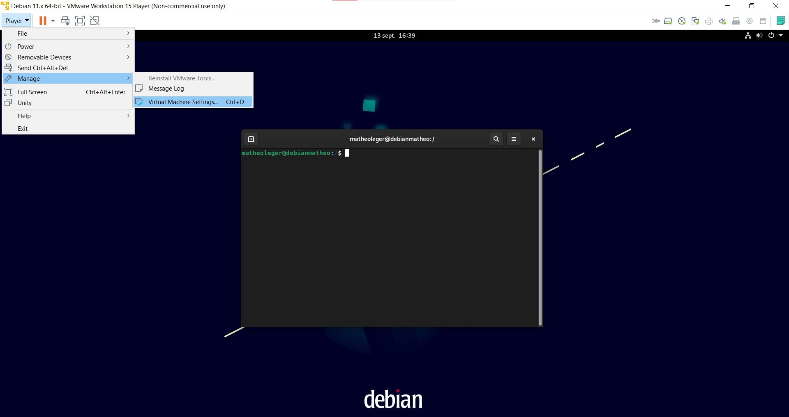

Puis, il faut aller dans la partie ***Network Adaptateur*** et choisir ***Bridged***

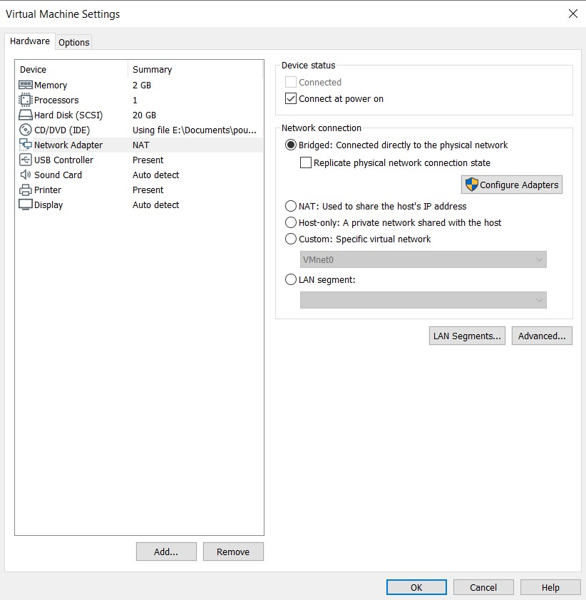

Si jamais, il y a un problème lors du lancement de la Machine Virtuelle (plus de connection avec le réseau). Il se peut que la configuration en pont n'utilise pas le bon adaptateur par défaut.

Par conséquent, il faut aller sur ***Configure Adapters*** et choisir le bon adaptateur :

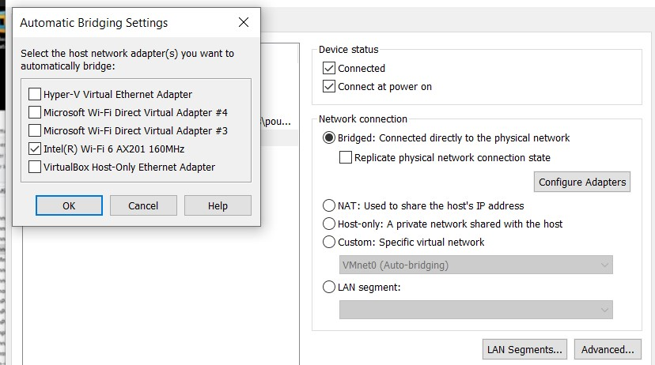

Il faut faire la même configuration des "adaptateurs réseaux", pour les 2 VMs.

Ensuite, il ne **reste plus qu'a vérifier** :

Pour comprendre, voici les adresses IPv4 :
- IPv4 de la machine virtuelle sous Debian 11 (serveur) : `192.168.1.63`
- IPv4 de la machine virtuelle sous Windows 10 (client) :
`192.168.1.64`
- IPv4 de la machine hôte sous Windows 10 : `192.168.1.56`

Toutes les machines sont bien dans le même réseau. Elles ont dailleurs toutes une adresse de **passerelle/route** qui est `192.168.1.1`

Afin de vérifier si tout fonctionne, on va utiliser la commande `ping` (valable sur Linux et Windows)

:warning: Il peut y avoir un problème avec la VM Windows à cause du pare-feu. Si jamais le `ping` de la VM Debian vers la VM Windows ne marche pas, il faut donc soit désactiver le pare-feu soit le paramètrer.

Et voici donc les `ping` réaliser :


De la machine hôte (sous Windows) vers la machine virtuelle (sous Debian) :
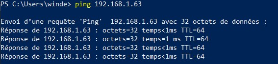


De la machine virtuelle (sous Debian) vers la machine hôte (sous Windows) :
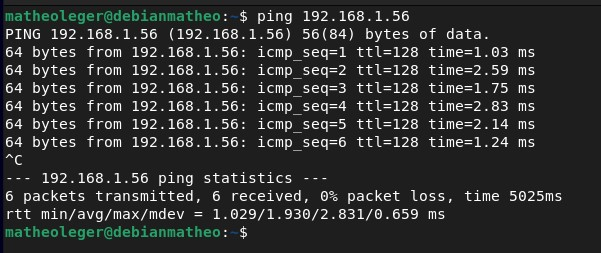

De la machine hôte (sous Windows) vers la machine virtuelle (sous Windows) : (il a fallut désactiver le pare-feu de la VM Windows)
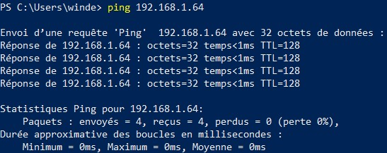

De la machine virtuelle (sous Windows) vers la machine hôte (sous Windows) :
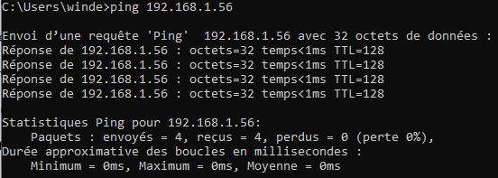

De la machine virtuelle (sous Debian) vers la machine virtuelle (sous Windows) : (il a fallut désactiver le pare-feu de la VM Windows)
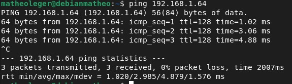

De la machine virtuelle (sous Windows) vers la machine virtuelle (sous Debian) : 
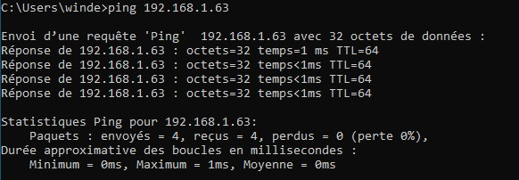

Tout fonctionne.

### Accès à internet

Dans notre cas, on n'a pas eu besoin de configurer quelque chose pour que cela fonctionne. En effet, le DNS a été configuré automatiquement pour les 2 VMs :

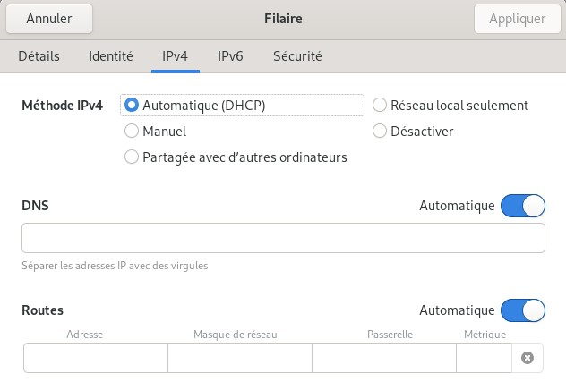

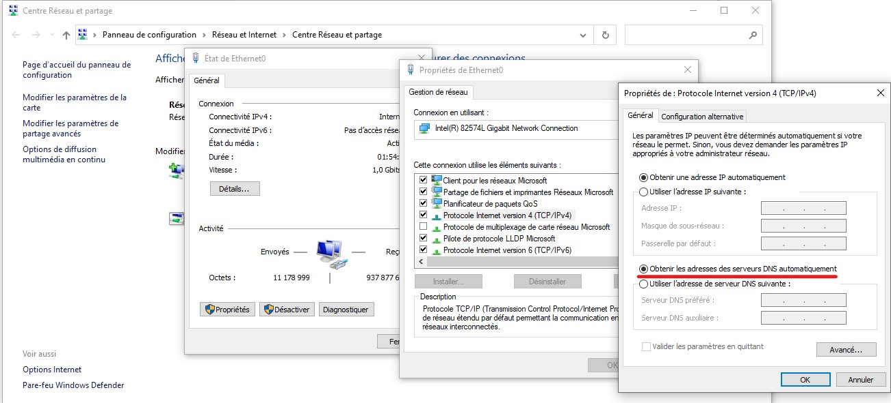

Il récupère automatiquement l'adresse de passerelle.

Mais dans le cas où internet ne marcherait pas, alors il faut configurer le DNS.

Pour la VM Windows il faut aller dans `Centre Réseaux et Partages > (le nom du réseau) > Propriétés` puis il faut cliquer sur ``TCP/IPv4`` et sur `Propriétés`

### Le SSH

Afin de rendre la configuration des outils (FusionInventory et GLPI) plus simple, on a installé ``openSSH`` afin de pouvoir acceder au serveur via notre machine hôte (machine sur laquelle on faisait les recherches pour configurer le serveur). 

Pour ce faire, il faut simplement installer le package openssh-server sur notre machine serveur :
```bash
matheoleger@debianmatheo sudo apt install openssh-server 
```
Une fois ceci fait, on peut directement acceder au shell via une autre machine.

> :bulb: Sur Windows 10, "OpenSSH client" est installé par défaut. Par conséquent, aucune installation n'est nécessaire.

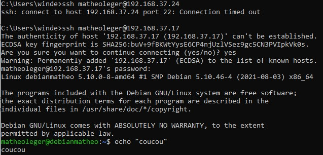

Comme on peut le voir ci-dessus, on utilise la commande `ssh username@ipadress` (le `username` correspond au nom de l'utilisateur du serveur auquel on veut acceder et `ipadress` c'est l'adresse de la machine serveur)

## Configuration d'un outil de gestion de ticket

> :bulb: Pour exécuter les commandes suivantes, il faut soit se mettre en ``root``, soit ajouter `sudo` au début de chaque commande.

### Les prérequis

Tout d'abord, il faut mettre à jour la liste des paquets

```sh
apt-get update && apt-get upgrade
```

Maintenant, on peut installer les outils nécessaire :

- installation de [Apache2](./definition.md#apache2) :
    ```sh
    apt-get install apache2 php libapache2-mod-php
    ```
- installation de [PHP](./definition.md#php) :
    ```sh
    apt-get install php-imap php-ldap php-curl php-xmlrpc php-gd php-mysql php-cas
    ```
- installation de [MariaDB](./definition.md#mariaDb) :
    ```sh
    apt-get install mariadb-server
    mysql_secure_installation
    ```
    Pour **MariaDB**, il y a plusieurs questions qui s'affiche lors de l'installation, il faut répondre "**Y**" à toutes.

    C'est ici que l'on va créer un utilisateur root pour **MariaDB**, et aussi supprimer l'utilsateur par défaut.

    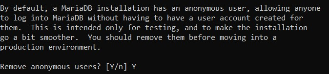

Il faut aussi installer quelques modules complémentaires pour GLPI :

Cette commande installe des modules pour un meilleur fonctionnement de GLPI (meilleure intéraction avec des technologies)

```sh
apt-get install apcupsd php-apcu
```

Ensuite, il faut redémarré les services *Apache2* et *MariaDB*:

(si jamais la deuxième ligne de la commande ne marche pas, remplacé `mysql` par `mariadb`)

```sh
/etc/init.d/apache2 restart
/etc/init.d/mysql restart
```
Maintenant, nous allons créer la base de données :

(Il faudra rentrer le mot de passe du compte root de MariaDB)

```sh
mysql -u root -p
```

> :bulb: MariaDB va donc ouvrir un **command prompt** (`MariaDB [(none)]>`) qui n'est plus celui de Debian. Les prochaines commandes sont comprise par le **prompt** de MariaDB.

```sh
MariaDB [(none)]> create database glpidb; 
MariaDB [(none)]> grant all privileges on glpidb.* to glpiuser@localhost identified by "votre-mot-de-passe";
MariaDB [(none)]> quit
```
Voici ce que font les commandes ci-dessus :
- La première commande va créer la base de données `glpidb`
- La deuxième commande donne les droits de cette base à l'utilisateur (qui est créé à ce moment là) `glpiuser` et défini le mot de passe. 
    :warning: Il faut changer "votre-mot-de-passe" par celui de votre choix.
- La dernière commande permet de quitter le *command prompt* de MariaDB.

Maintenant, pour plus de simplicité avec la *BDD*, on installera ``phpMyAdmin``, qui va vous permettre de gérer la base de données en interface graphique.

(Si jamais l'installation de PhpMyAdmin ne marche pas, il faut chercher un autre outils.)

```sh
apt-get install phpmyadmin
```

Un menu va s'ouvrir, il faut choisir *Apache2* puis répondre *NON* à la demande de création de ``db_common``.

Tout ce qu'on a fait jusque là, à permit de créer un serveur de type ***LAMP*** (Linux Apache MySQL PHP).

### Installation de GLPI

L'installation de GLPI se fait en 2 temps, par ligne de commande puis par interface graphique.

Dans un premier temps, on va récupérer les **paquets GLPI** :
```sh
cd /usr/src/
wget https://github.com/glpi-project/glpi/releases/download/9.3.3/glpi-9.3.3.tgz
tar -xvzf glpi-9.3.3.tgz -C /var/www/html
```
> :bulb: Il existe une version 9.5, plus récente de GLPI, mais malheureusement, elle ne fonctionne pas avec l'outil FusionInventory.

Maintenant que nous avons récupérer les **paquets GLPI**, on peut donner les droits à notre serveur, d'intéragir avec eux.

```sh
chown -R www-data /var/www/html/glpi/
```

Maintenant, on peut passer à l'installation via l'interface graphique (web).

Pour y accéder, il faut ouvrir dans le navigateur, l'interface web se trouvant à l'adresse de `http://<adresse_ip_du_serveur>/glpi`.

> :warning: L'adresse Ipv4 utilisée ici, est différente de celle utilisée lors des test de ``ping`` (voir [plus haut](./main_page#configuration-réseau)). En effet, l'installation / configuration ont été fait sur un autre réseau.

Ici, se sera `http://192.168.191.17/glpi`, ce qui ouvrira :

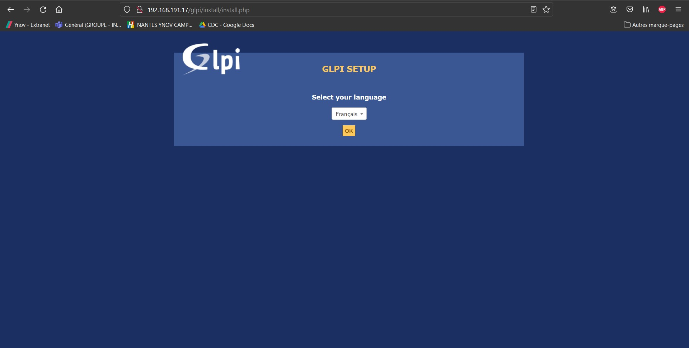

Il faut choisir la langue puis cliquer sur *OK*.

Ensuite, il faut accepter la Licence, puis cliquer sur *Continuer*.

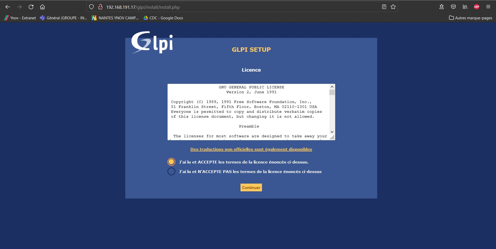

Puis, cliquer sur *Installer* :

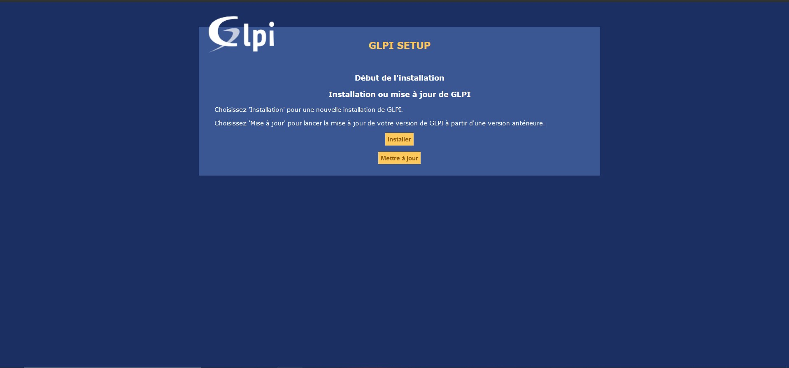

La page suivante nous montre tous les paquets qui doivent être installer :


Comme on peut le voir, dans notre cas, il y a une erreur sur 2 paquets.

Pour régler ces erreurs, la plupart du temps, il faut installer le paquet comme ceci :

```sh
apt-get install php-<nom_du_paquet_manquant>
```

Dans notre cas donc, il faut faire :

```sh
apt-get install php-mbstring
apt-get install php-simplexml
```
> :bulb: Au moment d'appuyer sur le bouton *Réessayer*, il pourrait y avoir aucun changement. Pour ce faire, il faut recharger le serveur Apache2 soit en faisant : `sudo service apache2 restart` soit en refaisant la commande `/etc/init.d/apache2 restart`


