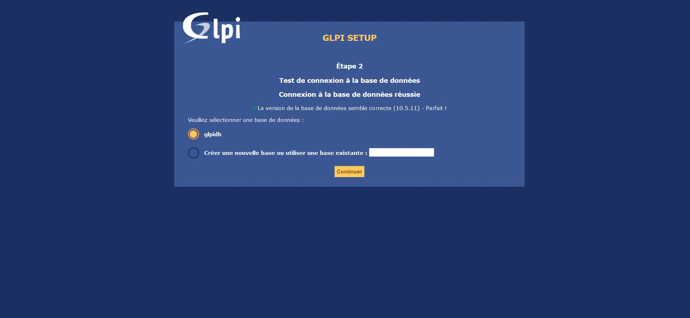

# :building_construction: TP n°1 :

## Sommaire du *TP n°1* :

- [Mise en place d'une machine virtuelle et configuration des services réseaux](./main_page.md#desktop_computer-mise-en-place-dune-machine-virtuelle)
- [Configuration d'un outil de gestion de ticket](./main_page.md#ticket-configuration-dun-outil-de-gestion-de-ticket)
- [Ajout au serveur, d'un plugin de remontée de poste client pour pouvoir réaliser l’inventaire du parc](./main_page.md#ajout-au-serveur-d-un-plugin-de-remontée-de-poste-client-pour-pouvoir-réaliser-linventaire-du-parc)
- [Mise en place d'un poste client Windows 10 et remonter le poste client dans l’inventaire GLPI](./main_page.md#mise-en-place-dun-poste-client-Windows-10-et-remonter-le-poste-client-dans-linventaire-GLPI)
- Mise en place d'une sauvegarde de GLPI

---

## :desktop_computer: Mise en place d'une machine virtuelle et configuration des services réseaux

### Avant de commencer.

Tout d'abord, il faut installer une **VM serveur** (debian 11) et une **VM client** (windows 10).

Pour ce faire, on utilise (dans notre cas) l'outils **VMWare Workstation Player**


Comme on peut le voir, il y a bien 2 VMs d'installées.

### :electric_plug: Configuration réseau

Afin que les 2 machines virtuelles puissent communiquer entre elle, il va falloir configurer la partie réseau comme ceci :

Tout d'abord, il faut se rendre dans ***Manage > Virtual Machine Settings***


Puis, il faut aller dans la partie ***Network Adaptateur*** et choisir ***Bridged***


Si jamais, il y a un problème lors du lancement de la Machine Virtuelle (plus de connection avec le réseau). Il se peut que la configuration en pont n'utilise pas le bon adaptateur par défaut.

Par conséquent, il faut aller sur ***Configure Adapters*** et choisir le bon adaptateur :


Il faut faire la même configuration des "adaptateurs réseaux", pour les 2 VMs.

Ensuite, il ne **reste plus qu'a vérifier** :

Pour comprendre, voici les adresses IPv4 :
- IPv4 de la machine virtuelle sous Debian 11 (serveur) : `192.168.1.63`
- IPv4 de la machine virtuelle sous Windows 10 (client) :
`192.168.1.64`
- IPv4 de la machine hôte sous Windows 10 : `192.168.1.56`

Toutes les machines sont bien dans le même réseau. Elles ont dailleurs toutes une adresse de **passerelle/route** qui est `192.168.1.1`

Afin de vérifier si tout fonctionne, on va utiliser la commande `ping` (valable sur Linux et Windows)

:warning: Il peut y avoir un problème avec la VM Windows à cause du pare-feu. Si jamais le `ping` de la VM Debian vers la VM Windows ne marche pas, il faut donc soit désactiver le pare-feu soit le paramètrer.

Et voici donc les `ping` réaliser :


De la machine hôte (sous Windows) vers la machine virtuelle (sous Debian) :


De la machine virtuelle (sous Debian) vers la machine hôte (sous Windows) :


De la machine hôte (sous Windows) vers la machine virtuelle (sous Windows) : (il a fallut désactiver le pare-feu de la VM Windows)


De la machine virtuelle (sous Windows) vers la machine hôte (sous Windows) :


De la machine virtuelle (sous Debian) vers la machine virtuelle (sous Windows) : (il a fallut désactiver le pare-feu de la VM Windows)


De la machine virtuelle (sous Windows) vers la machine virtuelle (sous Debian) : 


Tout fonctionne.

### :electric_plug: Accès à internet

Dans notre cas, on n'a pas eu besoin de configurer quelque chose pour que cela fonctionne. En effet, le DNS a été configuré automatiquement pour les 2 VMs :


Il récupère automatiquement l'adresse de passerelle.

Mais dans le cas où internet ne marcherait pas, alors il faut configurer le DNS.

Pour la VM Windows il faut aller dans `Centre Réseaux et Partages > (le nom du réseau) > Propriétés` puis il faut cliquer sur ``TCP/IPv4`` et sur `Propriétés`

### :electric_plug: Le SSH

Afin de rendre la configuration des outils (FusionInventory et GLPI) plus simple, on a installé ``openSSH`` afin de pouvoir acceder au serveur via notre machine hôte (machine sur laquelle on faisait les recherches pour configurer le serveur). 

Pour ce faire, il faut simplement installer le package openssh-server sur notre machine serveur :
```bash
matheoleger@debianmatheo:~$ sudo apt install openssh-server 
```
Une fois ceci fait, on peut directement acceder au shell via une autre machine.

> :bulb: Sur Windows 10, "OpenSSH client" est installé par défaut. Par conséquent, aucune installation n'est nécessaire.


Comme on peut le voir ci-dessus, on utilise la commande `ssh username@ipadress` (le `username` correspond au nom de l'utilisateur du serveur auquel on veut acceder et `ipadress` c'est l'adresse de la machine serveur)

---

## :ticket: Configuration d'un outil de gestion de ticket

> :bulb: Afin de réaliser cette partie, j'ai suivi le cours suivant : https://openclassrooms.com/fr/courses/1730516-gerez-votre-parc-informatique-avec-glpi/5993816-installez-votre-serveur-glpi

> :bulb: Pour exécuter les commandes suivantes, il faut soit se mettre en ``root``, soit ajouter `sudo` au début de chaque commande.

### :floppy_disk: Les prérequis

Tout d'abord, il faut mettre à jour la liste des paquets

```sh
apt-get update && apt-get upgrade
```

Maintenant, on peut installer les outils nécessaire :

- installation de [Apache2](./definition.md#apache2) :
    ```sh
    apt-get install apache2 php libapache2-mod-php
    ```
- installation de [PHP](./definition.md#php) :
    ```sh
    apt-get install php-imap php-ldap php-curl php-xmlrpc php-gd php-mysql php-cas
    ```
- installation de [MariaDB](./definition.md#mariaDb) :
    ```sh
    apt-get install mariadb-server
    mysql_secure_installation
    ```
    Pour **MariaDB**, il y a plusieurs questions qui s'affiche lors de l'installation, il faut répondre "**Y**" à toutes.

    C'est ici que l'on va créer un utilisateur root pour **MariaDB**, et aussi supprimer l'utilsateur par défaut.

    

Il faut aussi installer quelques modules complémentaires pour GLPI :

Cette commande installe des modules pour un meilleur fonctionnement de GLPI (meilleure intéraction avec des technologies)

```sh
apt-get install apcupsd php-apcu
```

Ensuite, il faut redémarré les services *Apache2* et *MariaDB*:

(si jamais la deuxième ligne de la commande ne marche pas, remplacé `mysql` par `mariadb`)

```sh
/etc/init.d/apache2 restart
/etc/init.d/mysql restart
```
Maintenant, nous allons créer la base de données :

(Il faudra rentrer le mot de passe du compte root de MariaDB)

```sh
mysql -u root -p
```

> :bulb: MariaDB va donc ouvrir un **command prompt** (`MariaDB [(none)]>`) qui n'est plus celui de Debian. Les prochaines commandes sont comprise par le **prompt** de MariaDB.

```sh
MariaDB [(none)]> create database glpidb; 
MariaDB [(none)]> grant all privileges on glpidb.* to glpiuser@localhost identified by "votre-mot-de-passe";
MariaDB [(none)]> quit
```
Voici ce que font les commandes ci-dessus :
- La première commande va créer la base de données `glpidb`
- La deuxième commande donne les droits de cette base à l'utilisateur (qui est créé à ce moment là) `glpiuser` et défini le mot de passe. 
    :warning: Il faut changer "votre-mot-de-passe" par celui de votre choix.
- La dernière commande permet de quitter le *command prompt* de MariaDB.

Maintenant, pour plus de simplicité avec la *BDD*, on installera ``phpMyAdmin``, qui va vous permettre de gérer la base de données en interface graphique.

(Si jamais l'installation de PhpMyAdmin ne marche pas, il faut chercher un autre outils.)

```sh
apt-get install phpmyadmin
```

Un menu va s'ouvrir, il faut choisir *Apache2* puis répondre *NON* à la demande de création de ``db_common``.

Tout ce qu'on a fait jusque là, à permit de créer un serveur de type ***LAMP*** (Linux Apache MySQL PHP).

### :tickets: Installation et configuration de GLPI

L'installation de [GLPI](./definition.md#glpi) se fait en 2 temps, par ligne de commande puis par interface graphique.

Dans un premier temps, on va récupérer les **paquets GLPI** :
```sh
cd /usr/src/
wget https://github.com/glpi-project/glpi/releases/download/9.3.3/glpi-9.3.3.tgz
tar -xvzf glpi-9.3.3.tgz -C /var/www/html
```
> :bulb: Il existe une version 9.5, plus récente de GLPI, mais malheureusement, elle ne fonctionne pas avec l'outil FusionInventory.

Maintenant que nous avons récupérer les **paquets GLPI**, on peut donner les droits à notre serveur, d'intéragir avec eux.

```sh
chown -R www-data /var/www/html/glpi/
```

Maintenant, on peut passer à l'installation via l'interface graphique (web).

Pour y accéder, il faut ouvrir dans le navigateur, l'interface web se trouvant à l'adresse de `http://<adresse_ip_du_serveur>/glpi`.

> :warning: L'adresse Ipv4 utilisée ici, est différente de celle utilisée lors des test de ``ping`` (voir [plus haut](./main_page#electric_plug-configuration-réseau)). En effet, l'installation / configuration ont été fait sur un autre réseau.

Ici, se sera `http://192.168.191.17/glpi`, ce qui ouvrira :


Il faut choisir la langue puis cliquer sur *OK*.

Ensuite, il faut accepter la Licence, puis cliquer sur *Continuer*.


Puis, cliquer sur *Installer* :


La page suivante nous montre tous les paquets qui doivent être installer :


Comme on peut le voir, dans notre cas, il y a une erreur sur 2 paquets.

Pour régler ces erreurs, la plupart du temps, il faut installer le paquet comme ceci :

```sh
apt-get install php-<nom_du_paquet_manquant>
```

Dans notre cas donc, il faut faire :

```sh
apt-get install php-mbstring
apt-get install php-simplexml
```
> :bulb: Au moment d'appuyer sur le bouton *Réessayer*, il pourrait y avoir aucun changement. Pour ce faire, il faut recharger le serveur Apache2 soit en faisant : `sudo service apache2 restart` soit en refaisant la commande `/etc/init.d/apache2 restart`

Pour la dernière erreur, d'après le cours sur [OpenClassroom](https://openclassrooms.com/fr/courses/1730516-gerez-votre-parc-informatique-avec-glpi/5993816-installez-votre-serveur-glpi#/id/r-5994042) :

> Concernant la dernière erreur, c’est une alerte de sécurité qui informe qu’en tapant le nom des sous-répertoires dans l’URL du site, on a la possibilité de naviguer dans les fichiers via l’interface web ; ce qui est, vous vous en doutez, une faille de sécurité. Pour notre serveur d’essais, ça n’a pas d’importance, mais en production vous devrez verrouiller les sous-répertoires en y ajoutant un fichier .htaccess.

On peut donc appuyer sur *Continuer*.

Puis on arrive sur la page suivante, où il faut rentrer les informations comme ceci :
- serveur SQL : `localhost`
- utilisateur SQL : `glpiuser`
- mot de passe SQL : `<mot de passe vu précedemment>`


Après avoir cliquer sur *Continuer*, on arrive sur la page où il faut choisir la base de données. Il faut choisir celle qu'on a créé précédemment : ``glpidb``.

Puis on peut appuyer sur *Continuer* (:warning: il est important de ne pas appuyer plusieurs fois sur *Continuer* au risque de créer des problèmes).



Si tout est bon, on a cette page qui s'affiche : 


On peut appuyer sur *Continuer*.

Pour les étapes 4 et 5, ce ne sont pas des choix importants.

L'étape 6, en revanche, est importante car elle nous donne les identifiants et les mots de passe par défauts de GLPI.
Il faut donc tout garder : 


On peut donc maintenant se connecter à *GLPI* :


---

## :clipboard: Ajout au serveur, d'un plugin de remontée de poste client pour pouvoir réaliser l’inventaire du parc.

> :bulb: Afin de réaliser cette partie, j'ai suivi le cours suivant : https://openclassrooms.com/fr/courses/1730516-gerez-votre-parc-informatique-avec-glpi/5994176-installez-le-plugin-et-l-agent-fusioninventory

> :bulb: Pour exécuter les commandes suivantes, il faut soit se mettre en ``root``, soit ajouter `sudo` au début de chaque commande.

### :minidisc: Installer le plugin FusionInventory

Tout d'abord, il est important de savoir quelle version utiliser avec la version de GLPI. Pour ce faire, on peut regarder sur le site http://fusioninventory.org/

Dans notre cas, on utilise la *version 9.3+1.4* de FusionInventory.

On peut remettre à jour la liste des paquets :

```sh
apt-get update && apt-get upgrade
```

Puis on peut télécharger le plugin :

```sh
cd /usr/src
wget https://github.com/fusioninventory/fusioninventory-for-glpi/archive/glpi9.3+1.4.tar.gz
tar -zxvf glpi9.3+1.4.tar.gz -C /var/www/html/glpi/plugins 
```

Explication des lignes ci-dessus :
- La première commande nous permet d'aller dans le répertoire `usr/src`.
- La deuxième commande nous permet de récupérer le plugin fusionInventory.
- La troisième commande nous permet d'extraire l'archive précédemment récupérée.

Comme vu précédemment, il faut donner les droits au serveur :

```sh
chown -R www-data /var/www/html/glpi/plugins
```

Et afin d'éviter des erreurs avec GLPI, on va renommer le dossier du fusionInventory :

```sh
cd /var/www/html/glpi/plugins
mv fusioninventory-for-glpi-glpi9.3-1.4/ fusioninventory/
```

Maintenant, on peut retourner sur l'interface web, en utilisant l'utilisateur administrateur.


Ensuite, il faut aller dans *Configuration > Plugins*


On peut y retrouver le plugins FusionInventory qu'il faut installer en appuyant sur le boutons *Installer*.


Une fois l'installation terminé, on peut appuyer sur le bouton *Activer*.


### :minidisc: Configurer FusionInventory

Pour acceder au menu de FusionInventory, aller dans *Administration > FusionInventory*.


On va pouvoir régler le problème du ``crontab``. En effet, il est nécessaire, pour enlever l'erreur visible dans le menu, d'ajouter le fichier ``cron.php`` au [crontab](./definition#crontab) de Linux.

On reparlera du `crontab` plus en détail dans la partie [Mettre en place une sauvegarde de GLPI](./).

Pour faire ceci, on ouvre le *cron* avec :

```sh
crontab -u www-data -e
```
Puis on écrit :

```sh
*/1 * * * * /usr/bin/php5 /var/www/html/glpi/front/cron.php &>/dev/null
```
Une fois fait, pour que les modifications soient prise en compte, on redémarre le *cron* avec la ligne :

```sh
/etc/init.d/cron restart
```

Une fois relancer, on peut continuer la configuration sur l'interface web. On va donc dans *Configuration > Actions*.

Il faut y trouver l'action nommé ``taskscheduler`` et cliquer dessus.


Une fois sur le menu, on peut tout simplement cliquer sur le bouton *Executer*.


Et on aura donc régler le problème du `crontab`.

---

## :desktop_computer: Mise en place d'un poste client Windows 10 et remonter le poste client dans l’inventaire GLPI

> :bulb: Comme dit précédemment, une machine virtuelle a été installé comme client. 

> :bulb: Afin de réaliser cette partie, j'ai suivi le cours de OpenClassroom : https://openclassrooms.com/fr/courses/1730516-gerez-votre-parc-informatique-avec-glpi/5994176-installez-le-plugin-et-l-agent-fusioninventory#/id/r-6150440

### Installation et configuration de FusionInventory Agent

FusionInventory Agent s'installe sur les machines clients.

:bulb: Il permet de faire l'inventaire de notre parc informatique (il va donc afficher la machine client ayant installer l'agent)

Après avoir choisi la version correspondante à ma VM, on commence l'installation.

Il faut suivre les étapes d'installation jusqu'à ce qu'on arrive ici :


Il faut choisir une installation complète afin d'avoir tous les composants.

On continue les étapes (choisir le chemin d'installation), puis on arrive sur une étape importante :


C'est une étape très importante. Il faut donc mettre l'adresse comme ceci :

```txt
http://<adresse_ip_du_serveur>/glpi/plugins/fusioninventory/
```

Cela permet à l'agent fusionInventory d'envoyer son inventaire au serveur.

Une fois cette étape fait, il faut continuer en faisant une installation rapide.

On peut maintenant tester FusionInventory en ouvrant un navigateur web et en mettant dans l'adresse : `http://localhost:62354` ou `http://127.0.0.1:62354`.

On devrait arriver sur cette page :


On peut maintenant cliquer sur *force an inventory*, ce qui va envoyer l'inventaire.

Maintenant, on peut voir sur l'interface web de **GLPI**, dans la catégorie  *Administration > FusionInventory*, qu'il y a bien un Agent de déployer :


On peut aussi voir dans le sous-menu *Général > Gestion des agents*, qu'il y a bien l'agent déployer précédemment :


## :floppy_disk: Mise en place d'une sauvegarde de GLPI

> :bulb: Cette partie du TP a été réalisée à l'aide de cette page : https://christiansueur.com/sauvegarde-automatique-de-votre-serveur-glpi/

### Sauvegarde automatique grâce à crontab

Tout d'abord comment fonctionne le [crontab](./definition#crontab).

Comme on peut le voir dans la définition, le ``crontab`` va permettre de faire des commandes automatiques, à un moment précis (et de manière récurente).

On aura donc besoin de l'utiliser pour créer des sauvegardes automatiques.

Tout d'abord, on créé le script qui va permettre de faire la sauvegarde :

```sh
touch cron_glpi.sh
```
(J'ai choisi de mettre mon fichier dans un dossier personnelle, mais on peut très bien le mettre comme il est conseillé conventionnellement)

Une fois le fichier ouvert, j'y ai ajouté le script proposé sur un site internet (voir [ici](https://christiansueur.com/sauvegarde-automatique-de-votre-serveur-glpi/)).

Le script a été modifié afin de fonctionner avec mon système.

```sh
#!/bin/bash
# Backup Fichier

echo "lancement du scripts de backup"

mkdir /tmp/backup

bkpdate=$(date +'%Y-%m-%d')

bkp_dir=/tmp/backup/$bkpdate-bkp.tar.gz
glpi_dir=/var/www/html/glpi
bkp_sql=/tmp/backup/bkp.sql
bkp_gen=/tmp/backup-$bkpdate.tar.gz
bkp=/tmp/backup


#archive des fichiers de glpi
tar -cvzf $bkp_dir $glpi_dir

#archive de la base de donnée
glpi_user=glpiuser
glpi_pass=<monmdp>
mysqldump -u$glpi_user -p$glpi_pass -h localhost glpidb > $bkp_sql

#archive des fichiers et de la bdd
tar -cvzf $bkp_gen $bkp
```
Voici l'explication du script :

- Dans un premier temps, je créé le dossier ``backup`` dans le chemin `/tmp/` :

    ```sh
    mkdir /tmp/backup
    ```
- Je vais créé une variable `bkpdate` afin de récupérer la date. (pas besoin de mettre l'heure car notre cron va faire une sauvegarde à la même heure)

    ```sh
    bkpdate=$(date +'%Y-%m-%d')
    ```
    Ici `date` va nous donner la date et grâce au caractère qui suivent la commande, on va avoir un format de date sous la forme : `year-month-day`

- Nous avons ensuite la déclaration des variables qui contiennent les chemins qui seront nécessaire pour faire la sauvegarde :

    ```sh
    bkp_dir=/tmp/backup/$bkpdate-bkp.tar.gz
    glpi_dir=/var/www/html/glpi
    bkp_sql=/tmp/backup/bkp.sql
    bkp_gen=/tmp/backup-$bkpdate.tar.gz
    bkp=/tmp/backup
    ```
    On peut voir l'utilisation de la variable `$bkpdate`, afin de mettre dans le nom des archives, la date à laquelle la sauvegarde c'est effectué.

- Nous avons ensuite l'archive des fichiers de GLPI :

    ```sh
    #archive des fichiers de glpi
    tar -cvzf $bkp_dir $glpi_dir
    ```

- Puis on copie les données de la base de données :

    ```sh
    #archive de la base de donnée
    glpi_user=glpiuser
    glpi_pass=<monmdp>
    mysqldump -u$glpi_user -p$glpi_pass -h localhost glpidb > $bkp_sql
    ```
    La commande `mysqldumb` va permettre cette copie, il faut donner en option : le nom d'utilisateur et le mot de passe ainsi que le nom de la base de donnée.

- Et pour finir, on archive tout ce qu'on a récupérer / archiver précédemment :

    ```sh
    #archive des fichiers et de la bdd
    tar -cvzf $bkp_gen $bkp
    ```

> :bulb: la commande `tar` fonctionne comme ceci : 
> Pour la partie `-cvzf`, `-c` pour **compression**, `v` pour **verbeux** (pour afficher ce qui se passe dans la console, ``z`` car c'est un `.tar.gz` et f car c'est **obligatoire** pour **lire des fichiers**. 
> La commande se forme donc : `tar -cvzf <nom_de_l'archive> <chemin_du_dossier_à_archiver>`)

Une fois ce script mit en place, on peut commencer à installer 

