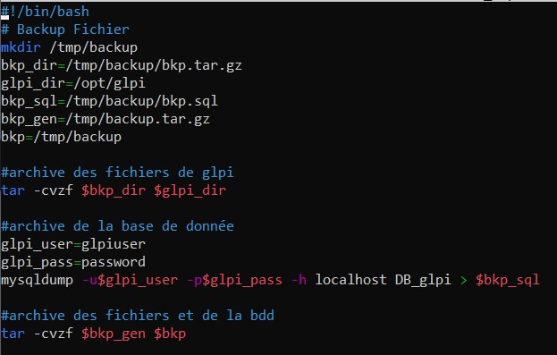
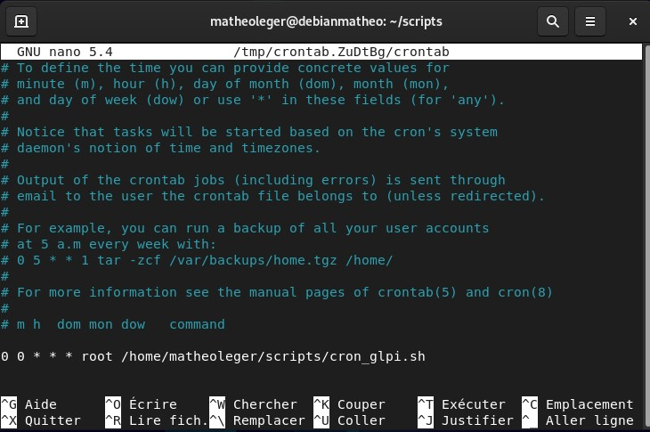

# :floppy_disk: Mise en place d'une sauvegarde de GLPI

> :bulb: Cette partie du TP a été réalisée à l'aide de cette page : https://christiansueur.com/sauvegarde-automatique-de-votre-serveur-glpi/

## Sauvegarde automatique grâce à crontab

Tout d'abord comment fonctionne le [crontab](./definition#crontab).

Comme on peut le voir dans la définition, le ``crontab`` va permettre de faire des commandes automatiques, à un moment précis (et de manière récurrente).

On aura donc besoin de l'utiliser pour créer des sauvegardes automatiques.

Avant de commencer à écrire le script et mettre en place le ``crontab``, il faut savoir quel type de sauvegarde de données existe, et lequel nous allons utiliser.

Il existe 4 techniques de sauvegarde (les plus communes) :
- La sauvegarde **complète** :
    On copie tous les fichiers de la source de données, et on stocke une sauvegarde de plus (la copie de la dernière sauvegarde).

    **Inconvénients :** Prend de la place. Le temps de sauvegarde est plus lent.

    **Avantages :** Opérations de restauration plus rapide et plus simples.

- La sauvegarde **incrémentale** :
    Il y a une sauvegarde initiale complète. Puis les sauvegardes suivantes ne stockent que les modifications apportées depuis la dernière sauvegarde. (Par conséquent, on ne garde que les modifications apportées lors de la dernière sauvegarde non complète.)

    
    (cliquez sur l'image pour trouver la source.)

    **Inconvénients :** Opérations de restauration plus lentes et plus complexe.

    **Avantages :** Prend le moins de place. Le temps de sauvegarde est plus rapide.


- La sauvegarde **différentielle** :
    L'idée est proche de celle de la sauvegarde incrémentale, mais à la différence qu'elle stocke toutes les modifications apportées depuis la dernière sauvegarde **complète**. (Par conséquent, on ne garde que les modifications apportées lors de la dernière sauvegarde complète, ce qui veut dire qu'on stocke plusieurs fois les mêmes choses.)

    
    (cliquez sur l'image pour trouver la source.)

    **Inconvénients :** Prend plus de place que l'incrémentale. Le temps de sauvegarde est un peu plus lent.

    **Avantages :** Opérations de restauration plus rapide que l'incrémentale et prend moins de place qu'une sauvegarde complète. Plus fiable que l'incrémentale.


- La sauvegarde **Miroir** :
    On copie exactement tous les fichiers sources des données. Il n'y a que 2 sauvegardes et elles sont modifiées 1/2 sauvegardes (Pendant que l'une est modifiée, l'autre stocke l'ancienne sauvegarde, puis on alterne)


Dans notre cas, on va utiliser le système de sauvegarde complète (pour des raisons de simplicité).


Maintenant, on créé le script qui va permettre de faire la sauvegarde :

```sh
touch cron_glpi.sh
```
(J'ai choisi de mettre mon fichier dans un dossier personnel, mais on peut très bien le mettre comme il est conseillé conventionnellement)

Une fois le fichier ouvert, j'y ai ajouté le script proposé sur un site internet (voir [ici](https://christiansueur.com/sauvegarde-automatique-de-votre-serveur-glpi/)).




Le script a été modifié afin de fonctionner avec mon système.

Il y a quand même quelques modifications apportées comme : l'ajout de la date, changement de certaines variables, etc...

```sh
#!/bin/bash
# Backup Fichier

echo "lancement du scripts de backup"

mkdir /tmp/backup

bkpdate=$(date +'%Y-%m-%d')

bkp_dir=/tmp/backup/$bkpdate-bkp.tar.gz
glpi_dir=/var/www/html/glpi
bkp_sql=/tmp/backup/bkp.sql
bkp_gen=/tmp/backup-$bkpdate.tar.gz
bkp=/tmp/backup


#archive des fichiers de glpi
tar -cvzf $bkp_dir $glpi_dir

#archive de la base de donnée
glpi_user=glpiuser
glpi_pass=<monmdp>
mysqldump -u$glpi_user -p$glpi_pass -h localhost glpidb > $bkp_sql

#archive des fichiers et de la bdd
tar -cvzf $bkp_gen $bkp
```
Voici l'explication du script :

- Dans un premier temps, je créé le dossier ``backup`` dans le chemin `/tmp/` :

    ```sh
    mkdir /tmp/backup
    ```
- Je vais créer une variable `bkpdate` afin de récupérer la date. (pas besoin de mettre l'heure car notre *cron* va faire une sauvegarde à la même heure)

    ```sh
    bkpdate=$(date +'%Y-%m-%d')
    ```
    Ici `date` va nous donner la date et grâce au caractère qui suivent la commande, on va avoir un format de date sous la forme : `year-month-day`

- Nous avons ensuite la déclaration des variables qui contiennent les chemins qui seront nécessaire pour faire la sauvegarde :

    ```sh
    bkp_dir=/tmp/backup/$bkpdate-bkp.tar.gz
    glpi_dir=/var/www/html/glpi
    bkp_sql=/tmp/backup/bkp.sql
    bkp_gen=/tmp/backup-$bkpdate.tar.gz
    bkp=/tmp/backup
    ```
    On peut voir l'utilisation de la variable `$bkpdate`, afin de mettre dans les noms des archives, la date à laquelle la sauvegarde s'est effectuée.

    :warning: Il se peut que votre chemin d'accès aux fichiers de GLPI soit différent, par conséquent, il faut rechercher où sont mis vos fichiers.

- Nous avons ensuite l'archive des fichiers de GLPI :

    ```sh
    #archive des fichiers de glpi
    tar -cvzf $bkp_dir $glpi_dir
    ```

- Puis on copie les données de la base de données :

    ```sh
    #archive de la base de donnée
    glpi_user=glpiuser
    glpi_pass=<monmdp>
    mysqldump -u$glpi_user -p$glpi_pass -h localhost glpidb > $bkp_sql
    ```
    La commande `mysqldumb` va permettre cette copie, il faut donner en option : le nom d'utilisateur et le mot de passe ainsi que le nom de la base de données.

- Et pour finir, on archive tout ce qu'on a récupéré / archivé précédemment :

    ```sh
    #archive des fichiers et de la bdd
    tar -cvzf $bkp_gen $bkp
    ```

> :bulb: la commande `tar` fonctionne comme ceci : 
> Pour la partie `-cvzf`, `-c` pour **compression**, `v` pour **verbeux** (pour afficher ce qui se passe dans la console, ``z`` car c'est un `.tar.gz` et f car c'est **obligatoire** pour **lire des fichiers**. 
> La commande se forme donc : `tar -cvzf <nom_de_l'archive> <chemin_du_dossier_à_archiver>`)

Une fois ce script mit en place, on peut commencer à installer, la routine du ``crontab``

Pour ce faire, on tape la commande :

```sh
sudo crontab -e
```

La fenêtre suivante devrait s'ouvrir :



Il faut y ajouter notre nouvelle "*routine*".

On peut y ajouter la ligne utilisée par le tutoriel :

```sh
0 0 * * * root /home/matheleger/scripts/cron_glpi.sh
```

Malheureusement, cette ligne ne marchera pas forcément. De plus, le fait de faire une sauvegarde tous les jours n'est pas forcément une bonne solution. Voici ce que l'on peut modifier :

- Dans le cas d'un ``cron`` mis en place sur **Debian 11**, il faut utiliser `su root` au lieu de `root`.

- Afin de faire une sauvegarde **du Lundi au Jeudi**, à 00h, on peut faire : `0 0 * * 1-4`

Donc la ligne utilisé dans notre cas est la suivante :

```sh
0 0 * * 1-4 su root /home/matheleger/scripts/cron_glpi.sh
```
(Pour tester le cron on peut changer l'heure et la remettre après le test effectué)

On peut donc voir si cela a marché dans le répertoire `/tmp/` :


Il y a bien le dossier ``backup`` et l'archive de ``backup``.


## :chart_with_upwards_trend: Axes d'améliorations

On pourrait améliorer le script en y ajoutant une fonction qui supprime automatiquement le dossier backup (pour gagner de la place), qui supprime les archives trop anciennes, etc...

On pourrait aussi utiliser l'un des types de sauvegarde comme, la sauvegarde différentielle qui est, selon moi, un bon compromis entre gain de place et fiabilité de restauration.

---

[<--- Mise en place d'un poste client Windows 10 et...](./config_fusioninv_agent.md) | page 5 | [Mettre en place un serveur de messagerie --->](./serveur-mail.md)