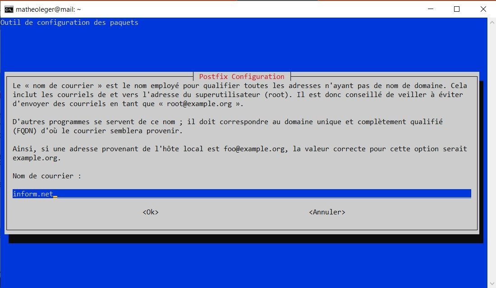

# :email: Mettre en place un serveur de messagerie.

> :bulb: Afin de réaliser cette partie, j'ai suivi le cours suivant : https://www.tecmint.com/install-postfix-mail-server-with-webmail-in-debian/

> :bulb: Pour exécuter les commandes suivantes, il faut soit se mettre en ``root``, soit ajouter `sudo` au début de chaque commande.

## :floppy_disk: Prérequis

Comme d'habitude, on commence par mettre à jour la liste des paquets :

```sh
apt-get update && apt-get upgrade 
```

Ensuite, il est conseillé de faire la commande suivante, afin d'être sûr d'avoir les paquets nécessaires. 

```sh
apt-get install curl net-tools bash-completion wget lsof nano
```

Ensuite il faut ouvrir le fichier `host.conf` en faisant :

```sh
nano /etc/host.conf
```

Puis, à l'intérieur de ce dernier, écrire ceci :

```sh
order hosts,bind
multi on
```
(Cela permet à DNS de lire le fichier `hosts` au départ.)

```sh
hostnamectl set-hostname mail.tecmint.com
echo "192.168.0.102 tecmint.com mail.inform.net" >> /etc/hosts
init 6
```

Voici l'explication des lignes ci-dessus :
- La première commande permet de configurer le [FQDN](./definition.md#fqdn) : dans notre cas, le nom d'hôte est "*mail*" car nous voulons créer un serveur *mail*. Le domaine est "*inform*" car c'est le nom de domaine acheté (même si en réalité on ,n'a pas accès à se nom de domaine). Enfin, nous avons "*.net*" car c'est le *TLD*.

- Ensuite la deuxième comment permet de placer dans le fichier `hosts`, l'adresse Ipv4 du serveur, le nom de domaine ainsi que le *FQDN* afin de savoir à quoi sert le serveur.

- Enfin, nous utilisons la dernière commande afin de redémarrer le système.

Une fois ceci fait, on peut vérifier si tout est bien configuré en utilisant les commandes suivantes :

```sh
hostname
hostname -s
hostname -f
hostname -A
hostname -i
cat /etc/hostname 
```

De plus, on peut tester si le domaine répond avec les lignes :

```sh
getent ahosts mail.tecmint.com
ping tecmint.com
ping mail.tecmint.com
```
(Si cela fonctionne, on devrait avoir un résultat similaire)


## :mailbox: Installation du serveur de mail Postfix

Afin de créer un serveur de mail, nous allons utiliser *Postfix* comme [MTA](./definition.md#postfix).

Pour l'installer, on fait la commande :

```sh
apt-get install postfix
```

Lors de l'installation, une fenêtre va s'ouvrir :


Il faut choisir *Site Internet*.  
Puis sur la page suivante, il faut avoir son nom de domaine écrit dans la zone *Nom de courrier*.



L'installation est donc terminé.

## :mailbox: Configuration de Postfix

Avant de modifier les paramètres, on fait une sauvegarde du fichier :

```sh
cp /etc/postfix/main.cf{,.backup}
```

Puis on entre dans le vrai fichier :

```sh
nano /etc/postfix/main.cf
```

Une fois dans le fichier, il faut mettre les informations suivantes :

Il faut definir les variables `myhostname` avec le nom de l'hôte (donc ``mail.inform.net``), `mydomain` avec le nom de domaine (donc `inform.net`) et remplacer l'adresse IPv4 dans ``mynetworks`` par celle du serveur (donc ``192.168.1.17``).

```sh
# See /usr/share/postfix/main.cf.dist for a commented, more complete version

smtpd_banner = $myhostname ESMTP
biff = no
# appending .domain is the MUA's job.
append_dot_mydomain = no
readme_directory = no

# See http://www.postfix.org/COMPATIBILITY_README.html -- default to 2 on
# fresh installs.
compatibility_level = 2

# TLS parameters
smtpd_tls_cert_file=/etc/ssl/certs/ssl-cert-snakeoil.pem
smtpd_tls_key_file=/etc/ssl/private/ssl-cert-snakeoil.key
smtpd_use_tls=yes
smtpd_tls_session_cache_database = btree:${data_directory}/smtpd_scache
smtp_tls_session_cache_database = btree:${data_directory}/smtp_scache

# See /usr/share/doc/postfix/TLS_README.gz in the postfix-doc package for
# information on enabling SSL in the smtp client.

smtpd_relay_restrictions = permit_mynetworks permit_sasl_authenticated defer_unauth_destination
myhostname = mail.debian.lan

mydomain = debian.lan

alias_maps = hash:/etc/aliases
alias_database = hash:/etc/aliases

#myorigin = /etc/mailname
myorigin = $mydomain

mydestination = $myhostname, $mydomain, localhost.$mydomain, localhost
relayhost = 
mynetworks = 127.0.0.0/8, 192.168.1.0/24
mailbox_size_limit = 0
recipient_delimiter = +
inet_interfaces = all
#inet_protocols = all
inet_protocols = ipv4

home_mailbox = Maildir/

# SMTP-Auth settings
smtpd_sasl_type = dovecot
smtpd_sasl_path = private/auth
smtpd_sasl_auth_enable = yes
smtpd_sasl_security_options = noanonymous
smtpd_sasl_local_domain = $myhostname
smtpd_recipient_restrictions = permit_mynetworks,permit_auth_destination,permit_sasl_authenticated,reject
```

On peut ensuite faire la commande `postconf -n` pour voir s'il y a des erreurs.

Une fois que tout est bon, on redémarre certains services :

```sh
systemctl restart postfix
systemctl status postfix
netstat -tlpn
```

Malheureusement, je n'ai pas pu aller plus loin donc voilà à quoi je me suis arrêté...

## :chart_with_upwards_trend: Axes d'améliorations

- Pour continuer, il faudrait tester la configuration précédente afin de voir si le serveur a bien été mis en place.

    Ensuite, il aurait fallut installer un [agent de distribution de courriel](./definition.md#mda) (un *MDA* ou *Mail Delivery Agent*). En effet, ce dernier nous aurait permis de remettre des mails aux boîtes aux lettres d'un destinataire local.

    Il y aurait eu encore plein d'étape pour mettre en place, complètement le serveur mail.

- Au niveau de **FusionInventory**, on aurait pu donc **configurer des collecteurs** afin de convertir les **mails** en **tickets**.

[<--- Mise en place d'une sauvegarde de GLPI](./config_fusioninventory.md) | page 6 | [ Conclusion --->](./sauvegarde_glpi.md)


