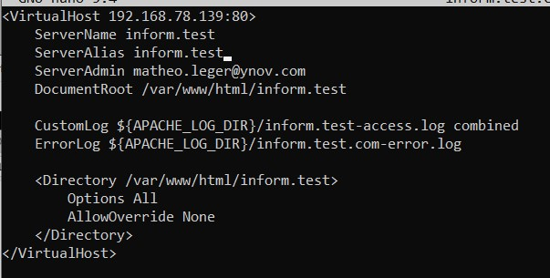

# :artificial_satellite: Configuration d'un service de Haute Disponibilité avec Corosync et Pacemaker

## Qu'est ce que la *Haute disponibilité*

La définition de la Haute disponibilité se trouve [ici](./definition.md#HA).

Dans notre cas, la **haute disponibilité** fonctionne avec 2 machines serveurs. Le serveur dit *master*, sera le serveur principal. Il fera tourner notre serveur web quand il n'y a pas de problème. Mais dans le cas où la machine *master* ne marche plus, alors c'est la machine *slave* qui prend le relais. En effet, cette machine à la même configuration (au niveau software) que la *Debian* *master* (donc dans notre cas, l'installation d'Apache.)

La machine *slave* n'a pas besoin d'être aussi performante que notre serveur principal. En effet, ce n'est qu'un serveur de "backup", donc cette machine n'est là que dans le cas où il y a un problème avec la machine principale.

Mais alors, comment mettre en place un **site web** avec une seule adresse IPv4 ?

Et bien, c'est avec des outils comme [Corosync](./definition.md#corosync) et [Pacemaker](./definition.md#pacemaker) que nous mettons en place ce genre de chose. En effet, nous allons mettre en place une adresse IP virtuelle, ce qui permet de passer d'une machine à une autre, sans se soucier des changements d'adresse IP.


## Configuration d'un service de *Haute Disponibilité*

> Afin de réaliser cette partie, j'ai utilisé plusieurs ressources dont : https://wiki.bruno-tatu.com/wiki/cluster-corosync-pacemaker et https://memo-linux.com/creer-un-cluster-ha-avec-corosync-et-pacemaker/

Nous allons voir dans cette partie, la base de la mise en place d'une HA.

:bulb: Il faut faire, sauf indication, les manipulations sur les 2 machines.

Tout d'abord, il faut mettre à jour la liste des paquets :

```sh
sudo apt update && sudo apt upgrade
```

Puis installer les paquets nécessaires pour la HA :

```sh
sudo apt install pacemaker corosync crmsh
```

Une fois les paquets installés, on peut commencer la configuration du [cluster](./definition.md#cluster). Pour ce faire, il va falloir spécifier aux 2 machines, le nom de domaine (utile dans la configuration) de la deuxième machine. On commence donc par ajouter dans le fichier `hosts`, les informations suivantes :

```sh
sudo nano /etc/hosts
```

On y ajoute :

```sh
192.168.78.133         lan-master
192.168.78.134         lan-slave
```


:bulb: À noter qu'il faut bien entendu changer les adresses IPv4 en fonction de celles qui correspondent à vos machines.

Il faut aussi que les 2 serveurs soient synchronisés au niveau du temps. Dans notre cas, comme nos machines sont toutes deux au même endroit, alors on n'a pas besoin de configurer cette partie.

Ensuite, on ouvre les ports UDP 5404 et 5405 en entrée et sortie :

```sh
iptables -I INPUT -m state --state NEW -p udp -m multiport --dports 5404,5405 -j ACCEPT
iptables -I OUTPUT -m state --state NEW -p udp -m multiport --sports 5404,5405 -j ACCEPT
```

``iptables`` est une interface pour **interagir** avec le pare-feu du noyau linux.  
:bulb: `ufw` est une interface pour **interagir** avec `iptables`. En effet, ``iptables`` peut, à première vue, paraître compliqué.

Dans notre cas, la commande reste assez claire:
- La **première ligne** va **ouvrir** les ports *5404* et *5405* pour *UDP* en **entrée**.
- La **deuxième ligne** va **ouvrir** les ports *5404* et *5405* pour *UDP* en **sortie**.

Sur le **serveur master**, il faut générér la clé d'authentification de corosync, pour que les 2 serveurs puissent communiquer :

```sh
sudo corosync-keygen
```

Puis, il faut copier la clé d'un serveur à l'autre comme ceci :

```sh
sudo scp /etc/corosync/authkey mleger@lan-slave:/etc/corosync/
```

:bulb: Plusieurs choses sont à noter (pour éviter les erreurs) :
- La copie se fait via le **port 22** par défaut, donc si le serveur à un **pare-feu**, il faut autorisé le **port 22**.
- La copie peut ne pas marcher pour la raison `Permission denied`. Cela peut venir du fait que l'utilisateur avec lequel vous essayez de faire la copie (dans le cas présent, j'essaye de copier vers la *machine slave* avec l'utilisateur **mleger**), n'est pas autorisé à accéder au dossier.   
    De plus, si vous avez des problèmes lors de cette commande avec l'utilisation du root (au lieu d'un autre utilisateur), il faudra donc utiliser un autre utilisateur.

    Pour que l'utilisateur soit autorisé, il faut utiliser la commande :
    ```sh
    sudo chmod 777 /etc/corosync
    ```
    Cette commande donne les droits d'accès en lecture et écriture à tout le monde (vous pouvez aussi changer le propriétaire du dossier)

Une fois que la copie a été effectuée, on doit configurer le fichier ``corosync.conf`` **sur les deux machines**. Afin d'éviter toute erreur, on va faire une copie de ce fichier :

On peut renommer le fichier `corosync.conf` en `corosync.back` :

```sh
sudo mv /etc/corosync/corosync.conf /etc/corosync/corosync.back
```

Puis on peut recréer un fichier ``corosync.conf`` :
```sh
touch /etc/corosync/corosync.conf
```

Il faut maintenant mettre la nouvelle configuration en place :

```sh
logging {
  debug: off
  to_syslog: yes
}
nodelist {
  node {
    name: lan-master
    nodeid: 1
    quorum_votes: 1
    ring0_addr: <ADRESSE DE LA MACHINE MASTER>
  }
  node {
    name: lan-slave
    nodeid: 2
    quorum_votes: 1
    ring0_addr: <ADRESSE DE LA MACHINE SLAVE>
  }
}
quorum {
  provider: corosync_votequorum
}
totem {
  cluster_name: cluster-ha
  config_version: 3
  ip_version: ipv4
  secauth: on
  version: 2
  interface {
    bindnetaddr: <ADRESSE RESEAU / BROADCAST>
    ringnumber: 0
  }
}
```

Ici nous avons les éléments suivants qui sont important :

- `ring0_addr: <ADRESSE DE LA MACHINE MASTER>` : Il faut y mettre l'adresse de la *machine master*, dans mon cas c'était `192.168.78.133`

- `ring0_addr: <ADRESSE DE LA MACHINE SLAVE>` : Il faut y mettre l'adresse de la *machine slave*, dans mon cas c'était `192.168.78.134`

- `bindnetaddr: <ADRESSE RESEAU / BROADCAST>` : Il faut y mettre une adresse en commun, personnellement, j'ai mis l'adresse de **Broadcast** : ``192.168.78.255``

(On peut soit faire une copie, comme vu précédemment, avec la commande `scp`, soit on peut juste faire la même manipulation sur les 2 serveurs)

On va aussi pouvoir désactiver 2 fonctionnalités inutiles dans notre cas :

- `stonith` : (shot the other node in the head) fonctionnalité pratique dans un environnement professionnel mais demande des configurations en plus pour pouvoir être vraiment utile.

    ```sh
    sudo crm configure property stonith-enabled=false
    ```
- `quorum` : Ce paramètre est utile pour des clusters à partir de trois machines. Il indique le nombre minimal de membres pour prendre une décision. 

    ```sh
    sudo crm configure property no-quorum-policy=ignore 
    ```

On peut à présent, démarrer les services :

```sh
sudo systemctl start corosync
sudo systemctl start pacemaker
```

On peut maintenant voir l'état de nos services en faisant :

```sh
sudo crm status
#ou avec
sudo crm_mon --one-shot -V
```

On devrait avoir ça :


Maintenant que tout est en place, on va créer nos adresses IP virtuelles :

On commence par créer une adresse IP de ``failover`` (une adresse IP de basculement).

Tout d'abord on fait la commande suivante, qui va ouvrir un "*sous terminal*", c'est-à-dire que les commandes rentrées prochainement ne seront reconnues que par ce "*sous terminal*" :

```sh
sudo crm
```

Maintenant on peut rentrer les commandes liées à `crm` :

On commence par créer une nouvelle configuration :

```sh
cib new mon-cluster
```

Puis, on continue en créant l'adresse IP virtuelle de ``failover``.
>:bulb: Cette adresse doit être une adresse du sous-réseau des 2 machines.

```sh
configure primitive failover-ip ocf:heartbeat:IPaddr2 params ip=192.168.78.139 op monitor interval=10s
```

Ensuite, on vérifie qu'on n'est pas fait d'erreurs :

```sh
configure verify
```
Si tout est bien, alors il n'y aura rien d'affiché (peut-être un message de *Warning* que l'on retrouve lors de la configuration globale).

On revient dans la configuration par défaut :

```sh
cib use live
```

Et on ajoute la nouvelle configuration :

```sh
cib commit mon-cluster
```

Et pour fermer le "*sous-terminal*", on tape :

```sh
quit
```

On peut désormais voir la nouvelle ressource configurée :

```sh
sudo crm status
#ou avec
sudo crm_mon --one-shot -V
```

Ce qui donne :


On peut remarquer qu'il y a bien l'adresse de ``failover`` qui est lancée sur la *machine master*.

On peut aussi tester la validité de cette adresse en essayant de la ping :

```sh
ping 192.168.78.139
```

S'il y a une réponse, alors c'est que l'adresse IP virtuelle fonctionne bel et bien.

On peut aussi créer une autre configuration pour Apache cette fois-ci :

> :warning: Il existe de nombreux tutoriels sur Internet pour réussir la configuration avec Apache via les commandes de corosync et pacemaker. Malheureusement, les configurations sont globalement faites sur CentOS (une autre distribution de Linux).
> La commande (elle sera précisée) est, je pense, compatible avec les machines Debian. Je n'ai malheureusement pas réussi à faire fonctionner cette commande sur ma machine serveur.

Comme vu précédemment, on ouvre `crm` et on entre les commandes de création de configuration :

```sh
crm
cib new apache-cluster
```

Puis on entre la commande qui va créer la primitive pour Apache : 

```sh
configure primitive httpd ocf:heartbeat:apache params configfile="/etc/apache2/apache2.conf" statusurl="http://192.168.78.140/server-status" op start timeout="60s" op stop timeout="60s" op monitor interval="10s"
```

On vérifie, puis on quitte :

```sh
configure verify
cib use live
cib commit apache-cluster
quit
```

On peut maintenant regarder notre configuration :


Comme on peut le voir, j'ai personnellement une erreur avec Apache. Il semblerait que ce soit lié au service **httpd** (fournis avec Apache ou même avec d'autres services.).   
Comme je l'ai dit précédemment, la plupart des configurations sont sur **CentOS** donc impossible de trouver la solution.

### Configuration avec Apache ("manuellement")

Il reste néanmoins une manière d'utiliser nos adresses IP virtuelles avec **Apache**.

En effet, comme on peut le voir ci-dessous, l'adresse de basculement marche :


Et si on arrête le cluster du côté de la **machine master** avec la commande `sudo crm cluster stop` (ou que l'on éteint la machine), on obtient :


Comme on peut le voir, l'adresse virtuelle est passée de l'état `Started lan-master` à `Started lan-slave`.

Ce qui veut dire que notre configuration de **Haute Disponibilité** fonctionne bel et bien.

Alors, afin de le faire **fonctionner avec Apache**, on fait :

Pour notre test, on oublie l'histoire de SSL, par conséquent, j'ai refait le test sur le **port 80**. Il faut donc configurer **notre 2ème serveur** (*machine slave*) :

- On configure le ``vhost`` :
    ```sh
    sudo nano /etc/apache2/sites-available/inform.test.conf
    ```

    Avec les éléments suivants :

    

    >:bulb: J'ai juste fait un copier-coller de la configuration de l'autre serveur. Dans le cas de notre test, le plus important reste le **ServerName** et l'adresse IPv4 mise dans le ``<VirtualHost>``.

    On reviendra juste après sur les choses qui sont indispensables pour le **bon fonctionnement** de notre **cluster**.

- On continue en faisant notre configuration du ``index.html`` :

    On créé notre dossier pour le site web :
    ```sh
    sudo mkdir /var/www/html/inform.test
    ```

    Puis à l'intérieur de ce dossier, on y met le **index.html**

    ```sh
    sudo nano index.html
    ```
    

    Ici pour faire la distinction entre les 2 serveurs :
    - Le premier serveur affichera ***Hello World !***
    - Le deuxième affichera ***Hello World 2 : La revanche !***

- Il ne reste plus qu'à ajouter notre site web à la configuration d'**Apache** :

    ```sh
    sudo a2ensite inform.test
    ```

- Et on **redémarre** le service :

    ```sh
    sudo systemctl restart apache2
    ```

Maintenant que le site est en place, il ne reste plus qu'une chose à bien **configurer** : l'**adresse IP virtuelle** pour nos hôtes virtuels !

Comme on a pu le voir rapidement ci-dessus, il faut impérativement mettre l'adresse virtuelle dans la **configuration** du ``<VirtualHost>`` :

```html
<VirtualHost <ADRESSE IP VIRTUELLE>:80>
    {...}
</VirtualHost>
```
:bulb: Il faut mettre à la place de `<ADRESSE IP VIRTUELLE>`, l'adresse ip virtuelle, dans mon cas c'est ``192.168.78.139`` qui correspond à l'adresse de ``failover``.

Cette **configuration** est à faire dans les **2 serveurs**.


Une fois ceci fait on peut tester :

On regarde l'état du ``crm``.


On regarde le rendu de la page à l'adresse ``192.168.78.139`` :
La page affiche *Hello World !* car c'est le contenu de la page sur la **machine master**.


On arrête le cluster du côté de la **machine master**.

On regarde le rendu de la page à l'adresse ``192.168.78.139`` :
La page affiche *Hello World 2 : La revanche !* car c'est le contenu de la page sur la **machine slave**.


On peut aussi regarder l'état du ``crm`` :


On a donc mis en place un système de **HA**.

---

## :chart_with_upwards_trend: Axes d'améliorations

Dans le cadre professionnel, il est peut-être préférable d'utiliser la primitive créée pour Apache (qui dans mon cas n'a pas marché).

---

[<--- Mettre en place un certificat SSL](./ssl.md) | Page 5 | [Conclusion --->](./conclusion.md)


