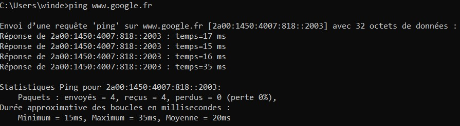
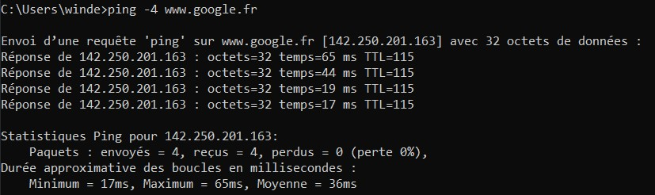
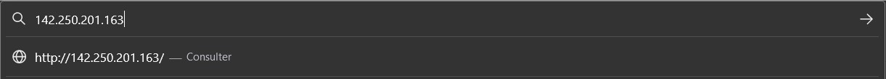
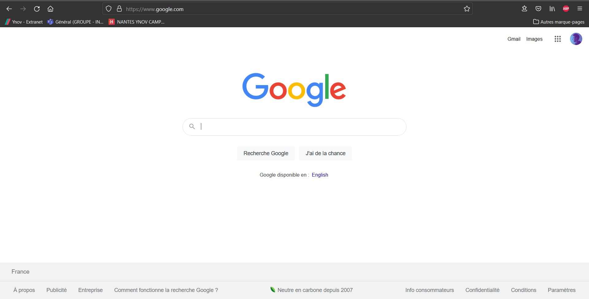
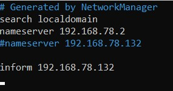
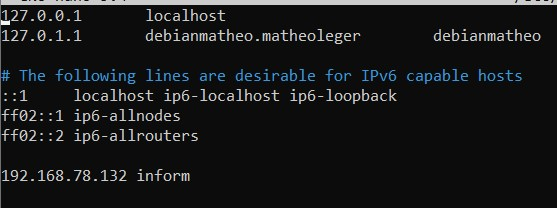
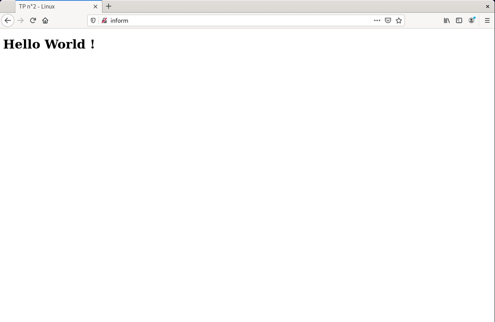
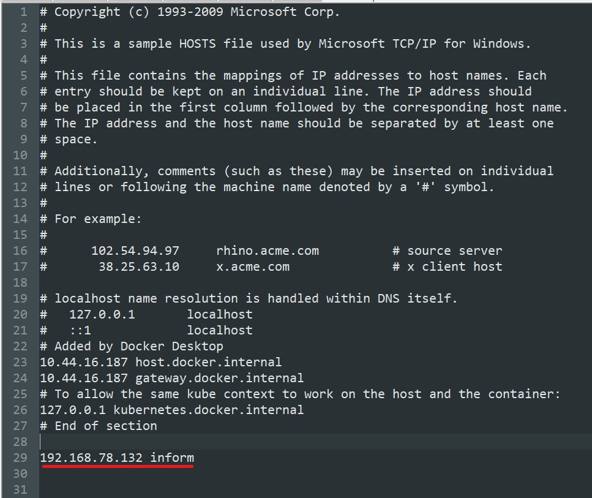
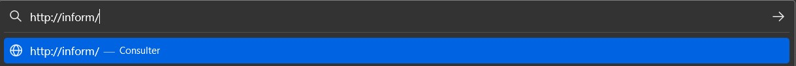
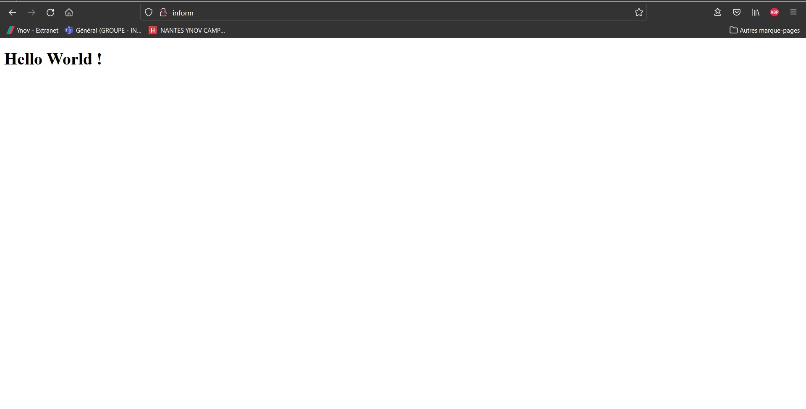

# :ticket: Configuration d'un nom de domaine pour le site web

## Qu'est ce qu'un nom de domaine

La définition du nom de domaine se trouve [ici](./definition.md#nom-de-domaine).

Pour faire simple, on utilise des noms de domaine pour naviguer sur internet (ou encore envoyer des mails).

En effet, il serait possible de naviguer sur internet via des adresses IP. Mais malheureusement, il serait difficile de les retenir, par conséquent il existe les noms de domaines qui permettent d'avoir un identifiant plus simple pour accéder à des sites web.

:floppy_disk: **Exemples :**

Si on `ping` le nom de domaine `www.google.fr`, on obtient :



À noter que, si l'on fait la commande `ping -4 <adresse>` on obtiendra l'adresse IPv4 du site que l'on essaye de `ping`. (voir ci-dessous)



Dans mon cas, l'adresse utilisé pour accéder au service de **Google**, c'est `142.250.201.163`.

On peut d'ailleur taper cette adresse IPv4 dans notre navigateur :



Ce qui nous dirige vers **Google** :



Le nom de domaine est unique, mais attention, dans un espace de nommage, c'est-à-dire qu'on peut avoir un site **inform.net** qui sera totalement différent d'un site **inform.com**.

Il faut faire la demande de ce nom de domaine pour l'utiliser publiquement. 

Le nom de domaine est décomposé comme suit :


 - **Sous-domaine :** C'est une partie facultative, qui permet de séparer un site web en plusieurs sections.
 - **Nom de domaine :** Elle est composé du **nom** ainsi que d'une extension. Cette partie est unique pour chaque site web, elle permet d'accéder à ce dernier.
 - **Nom :** C'est le **domaine de deuxième niveau** (SLD). Pas forcément unique, mais il est choisi par vous.
 - **Extension :** C'est le **domaine de premier niveau** (TLD). Ils sont prédéfinis (il en existe plus de 1000 différents, on peut potentiellement choisir celui que l'on veut)

D'après [afnic.fr](https://www.afnic.fr/noms-de-domaine/tout-savoir/) : 
> Le nom de domaine est composé d’une chaîne de caractères (nom propre, marque ou association de mots clés) et d’une extension qui indique l’espace de nommage. Il existe plusieurs types d’extensions : 
> - Des extensions nationales (ccTLD, “Country Code Top Level Domain”), comme le .fr, le .re ou les autres noms de domaine ultramarins gérés par l’Afnic ;
> - Des extensions génériques (gTLD, “Generic Top Level Domain”) dont les plus connues sont le .com, .net, .info, .biz. Depuis quelques années, de nombreuses nouvelles extensions génériques ont fait leur apparition, comme .paris, .bzh, .alsace, .corsica.


Pour en revenir sur l'étape de redirection de l'adresse IPv4 vers le nom de domaine :

Afin de traduire le nom de domaine en adresse IPv4 (qui nous permet d'accéder au site correspondant) on se sert d'un [DNS](./definition.md#DNS).

> :bulb: Chaque domaine doit être défini, au minimum, dans **deux serveurs DNS**. Ces serveurs peuvent être **interrogés** pour connaître l'**adresse IP associée** à un **nom d'hôte** ou le **nom d'hôte** associé à **une adresse IP**. - [Wikipédia](https://fr.wikipedia.org/wiki/Nom_de_domaine)

## :gear: Configuration du nom de domaine

Tout d'abord, il faut savoir que notre nom de domaine sera pour un **réseau privé**. En effet, il faudrait **louer ce nom de domaine** pour une utilisation sur **internet**. De plus, on pourra accéder au **site** via ce nom de domaine, que sur la **machine serveur** (on y reviendra plus tard).

Afin de configurer notre nom de domaine, on va devoir configurer 2 fichiers :

- Le premier fichier à configurer est le fichier `/etc/resolv.conf` :
    C'est un fichier de configuration permettant de savoir quel serveur DNS il faut utiliser pour résoudre un nom de domaine.

    Afin de rentrer dedans (et de ppuvoir le modifier) on fait la commande :

    ```sh
    sudo nano /etc/resolv.conf
    ```

    On doit y ajouter le nom de domaine ainsi que son adresse IP conrrespondante :

    

    Nous y avons donc ajouté le nom de domaine ``inform`` avec l'adresse IPv4 du serveur : `192.168.78.132`.

- Le deuxième fichier à configurer est le fichier `/etc/hosts` :
    C'est un fichier qui est consulté avant l'accès au serveur DNS.  
    Il est important, dans notre cas, de renseigner le **nom de domaine** ainsi que que l'**adresse IP**, afin d'accéder au site internet via le **nom de domaine**.

    En effet, n'ayant pas de serveur DNS personnel, et étant sur un réseau privé, ce fichier va permettre de faire la redirection du nom de domaine vers l'adresse IPv4.

    On y accède en faisant la commande :

    ```sh
    sudo nano /etc/hosts
    ```

    Une fois dans le fichier, on peut y ajouter la ligne que l'on veut :

    

    On peut d'ailleur voir dans ce fichier quelque chose d'intéressant :

    Il faut savoir que l'**adresse IPv4** ``127.0.0.1`` est l'adresse de **boucle locale**. C'est une adresse qui ne fonctionne que sur **notre machine locale**. (Elle est la même pour toutes les machines).

    Si on écrit **127.0.0.1** dans un navigateur on accédera à cette boucle locale (en fonction de son utilisation bien entendu). Et bien si on écrit `localhost`, on accédera à la même chose.

    En effet, ``localhost`` est bien le **nom de domaine** de la boucle locale `127.0.0.1`.

Pour que le **serveur Apache** prenne en compte les modifications apportées, il faut redémarré le **service**. Pour ce faire on tape la ligne suivante :

```sh
sudo /etc/init.d/apache2 restart
```

Afin de tester si notre **nom de domaine** a été pris en compte, on peut utiliser 2 méthodes :

- Dans le terminal : On peut taper la ligne `curl <domain_name>` et on devrait avoir le code de la page source s'afficher dans la console :

    ```sh
    matheoleger@debianmatheo:~$ curl inform
    <!DOCTYPE html>
    <html lang="en">
    <head>
        <meta charset="UTF-8">
        <meta http-equiv="X-UA-Compatible" content="IE=edge">
        <meta name="viewport" content="width=device-width, initial-scale=1.0">
        <title>TP n°2 - Linux</title>
    </head>
    <body>
        <h1>Hello World !</h1>
    </body>
    </html>
    ```

- Dans le navigateur : On peut aller dans un navigateur web et taper `http://inform` :

    


Comme on peut le remarquer, on a accès au site, via le nom de domaine, que sur la machine serveur.

Cela est dû au fait que le nom de domaine que l'on a choisi, n'est reconnu que dans la configuration de notre machine serveur.

Les fichiers ``resolv.conf`` et ``hosts`` permettent à la machine serveur de savoir à quoi correspond le **nom de domaine**.

En théorie, pour régler ce problème, on peut rédiriger les ports **80 et 443** (respectivement : HTTP & HTTPS) de notre box, vers l'IP de notre machine serveur.

Il y a aussi une autre solution, mais elle ne marchera que pour la machine configuré : On peut ajouter dans les **fichiers de configurations** de la **machine client**, le nom de domaine lié à l'**adresse IPv4 du serveur.**

Il faut donc aller dans le fichier ``hosts`` de notre machine (Linux, Windows, ou Mac).

Pour Windows c'est dans : `C:\Windows\System32\drivers\etc\hosts`

Pour Linux et Mac c'est : ``/etc/hosts``

Dans mon cas, j'ai fais un test avec la solution simple, je vais montrer sur ma machine sous Windows 10 :

- J'ouvre le fichier `hosts` :

    

Maintenant, on peut accéder à notre site via le **nom de domaine** :



Et voilà :



--------------------------------------------------------

## :chart_with_upwards_trend: Axes d'améliorations

Pour avoir une solution plus pérénnisable, on aurait dû utiliser un logiciel se nommant **Bind9**.

Ce logiciel permet de configurer les services DNS. Il est surtout utiliser quand on doit gérer beaucoup de **nom de domaine**. 

Dans notre cas, il était donc suffisant de configurer "à la main" notre nom de domaine.

En théorie, il aurait fallu installer Bind9 ainsi que les outils de test DNS (dnsutils) :

```sh
sudo apt-get install bind9 dnsutils
```

On peut configurer bind9 en allant dans le répertoire `/etc/bind`.

D'après le cours :

>Une fois configuré, on peut l’utiliser maintenant comme serveur DNS en référençant dans ``/etc/resolv.conf`` : la ligne ``nameserver 127.0.0.1``


On aurait aussi pu trouver une manière propre d'accéder au site via le nom de domaine (sur une autre machine du même réseau privé).

- Puis, on aurait pu utiliser un nom de domaine plus "officiel" : Utiliser un nom de domaine bien composé du **SLD et du TLD**. (À noter : on a besoin d'un vrai nom de domaine pour faire la **certification SSL**)

-----

[<--- Création d'un site web avec Apache (et PHP)](./organisation.md) | Page 3 | [Mettre en place un certificat SSL --->](./ssl.md)


