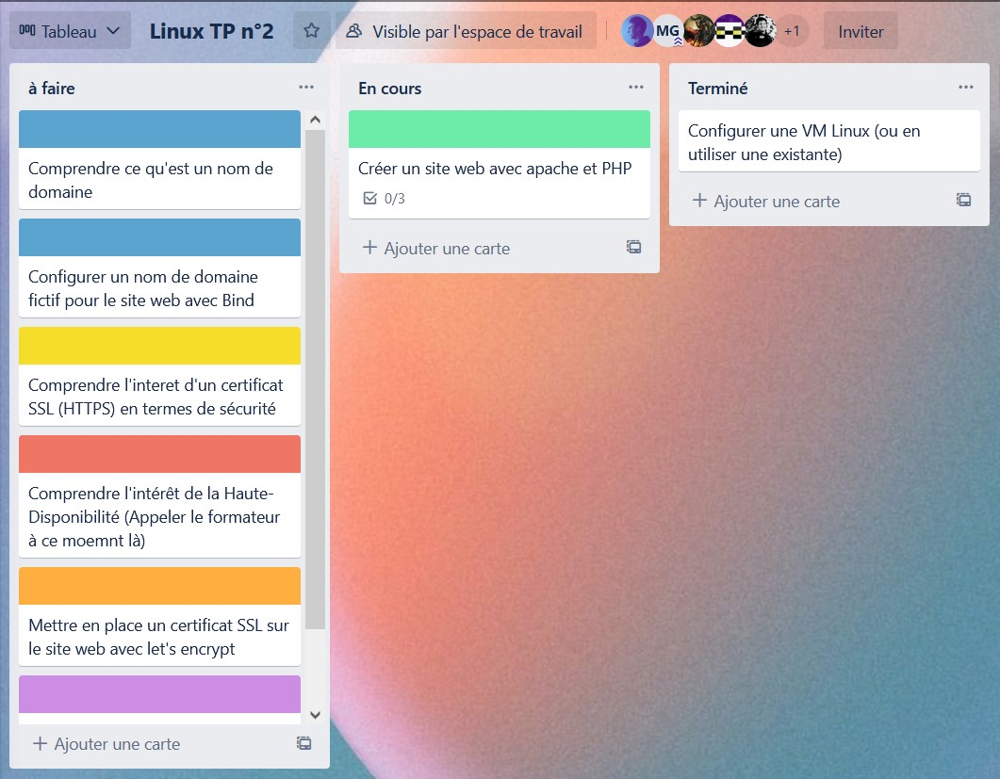

# :handshake: Organisation d'un groupe de réflexion

Nous nous sommes regroupés par groupe de 6, afin de s'entraider.

Nous avons donc commencé par nous organiser sur un Trello :

Nous avons donc pu lister les objectifs de ce TP. 

Comme on peut le voir, nous avons organisé le Trello comme ceci :

- À faire
- En cours
- Terminés

Même si l'organisation du Trello est basique, elle permet de voir ce que nous avons à faire, assez rapidement.

[<--- Page de garde](./main_page.md) | Page 1 | [Création d'un site web avec Apache (et PHP) --->](./site-web.md)