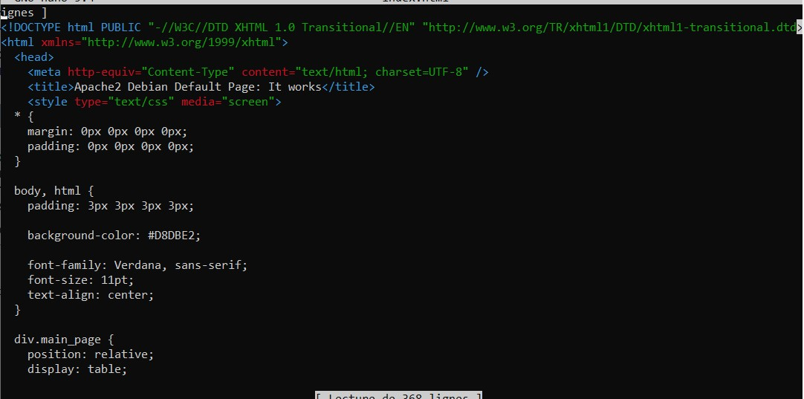

# :desktop_computer: Création d'un site Web avec Apache (et PHP)

## :gear: Avant de commencer : Configuration des VMs + configuration des services réseaux.

### Création de la VM

Avant de commencer la création d'un site Web, il nous faut une VM Debian.

Dans mon cas, j'ai réinstallé une Machine virtuelle **Debian 11**, pour des raisons de propreté du serveur.

Voici quelques images de la réinstallation de la VM :

- Choix de la langue :
    

- Partionnement du disque :
    

- etc... (il y a d'autres captures d'écrans, mais ce n'est pas très intéressant pour le TP.)

### Configuration des services réseaux

Une fois ceci fait, il reste la configuration du réseau à faire.

Au niveau de la configuration réseau de la Machine Virtuelle, on pouvait, dans notre cas, rester en NAT. Alors, il n'y avait rien à faire.

On peut configurer ceci dans les *Settings* de la machine virtuelle, dans la partie *Network Adapter* :


Ensuite, on doit regarder si on a **Internet** sur la machine virtuelle. Dans mon cas, j'avais directement accès à internet. En effet, la résolution DNS, c'est fait automatiquement (sûrement grace à NetworkManager) et mon adresse IP était directement déjà dans le sous-réseau.

Il se peut qu'il y ai des choses à configurer dans les paramètres de Debian :


On peut aussi avoir besoin de configurer un serveur DNS afin d'accéder à internet. Pour faire ceci de manière simple, on peut sûrement le configurer dans le fichier `/etc/resolv.conf`.

### Configuration SSH

Pour plus d'**aisance** lors des manipulations, j'ai mis en place (comme dans le TP précédent) **OpenSSH**.

Dans notre VM, il faut installer **OpenSSH-Server** grâce à la commande :

```sh
sudo apt-get install openssh-server
```

Si tout c'est bien passé, alors il ne reste plus qu'à se connecter avec notre machine client (machine hôte Windows 10), donc dans le cmd, on écrit :

```sh
ssh matheoleger@192.168.78.132
```

Une fois ceci fait on pourra accéder à notre **Serveur Debian**, via la **machine sous Windows** :


--------------------------------------------------------

## Installation d'Apache (et PHP)

Afin de créer un serveur Web, on va utiliser [Apache2](./definition.md#apache2).

Pour ce faire, on va commencer par mettre à jour la liste des paquets :

```sh
sudo apt-get update && sudo apt-get upgrade
```

Une fois cette commande effectuée, on va donc pouvoir installer **Apache** :

```sh
sudo apt-get install apache2
```

Une fois l'installation réalisée, on peut aller dans le répertoire :

```sh
cd /var/www/html
```

Une fois dans ce dossier, on peut y retrouver le fichier `index.html`, que l'on peut remplacer par notre propre page web.

Je l'ai donc remplacé ça :



par ça : 


Après avoir fait ça, on doit relancer le service Apache2 avec la commande :

```sh
sudo /etc/init.d/apache2 restart
```


Maintenant, quand on va sur notre navigateur web, et qu'on tape l'adresse du serveur (`192.168.78.132` dans mon cas), on obtient :


La base du serveur Web est donc mise en place.

## :chart_with_upwards_trend: Axes d'améliorations

Dans cette partie, afin de mettre en place le serveur le plus rapidement possible, nous n'avons pas configuré entièrement le serveur Apache.

- On aurait donc pu améliorer la sécurité en configurant davantage le serveur **Apache**.

    De plus, on aurait pu faire un système d'***hôtes virtuels*** (comme montré dans ce [cours](https://openclassrooms.com/fr/courses/1733551-gerez-votre-serveur-linux-et-ses-services/5236051-installez-le-serveur-web-le-plus-utilise-au-monde-apache#/id/r-5442839) de OpenClassrooms) afin d'avoir la possibilité de gérer **plusieurs sites web** sur une **seule machine**. D'ailleurs, nous allons le faire plus tard dans ce TP : [ici](./ssl.md#Mise-en-place-dun-Vhost-avec-Apache) (nous en avons besoin pour la **certification SSL**)

- On aurait aussi pu utiliser [PHP](./definition.md#PHP), avec notre serveur **Apache** (afin d'avoir des pages dynamiques) :

    Pour installer **PHP** avec **Apache**, il faut faire :

    ```sh
    sudo apt install php libapache2-mod-php
    ```
    Cette ligne va installer les modules nécessaires pour faire fonctionner **PHP** avec **Apache2**.

-------------

[<--- Organisation d'un groupe de réflexion](./organisation.md) | Page 2 | [Configuration d'un nom de domaine pour le site web --->](./nom-domaine.md)


