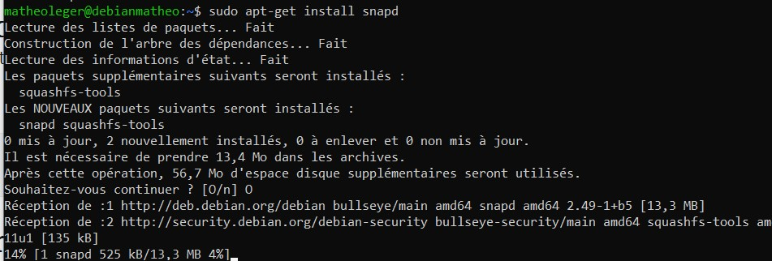
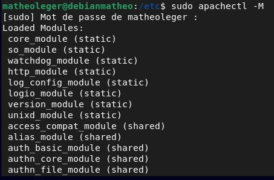
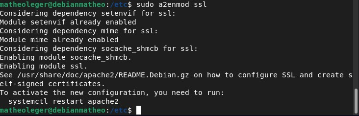
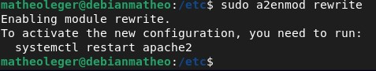
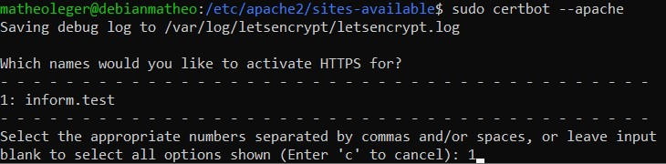
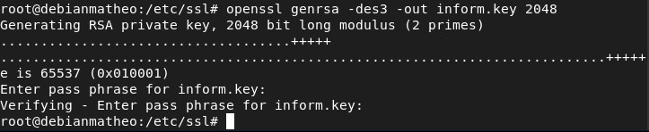
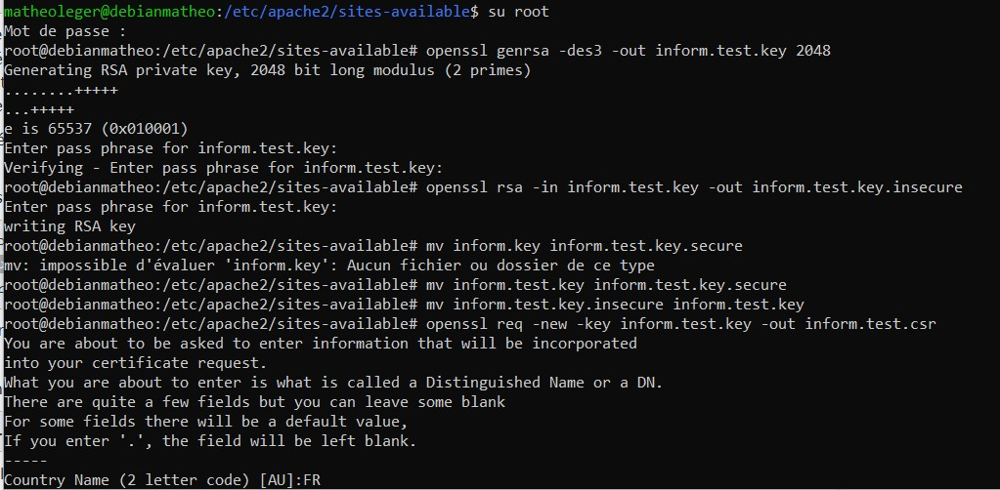
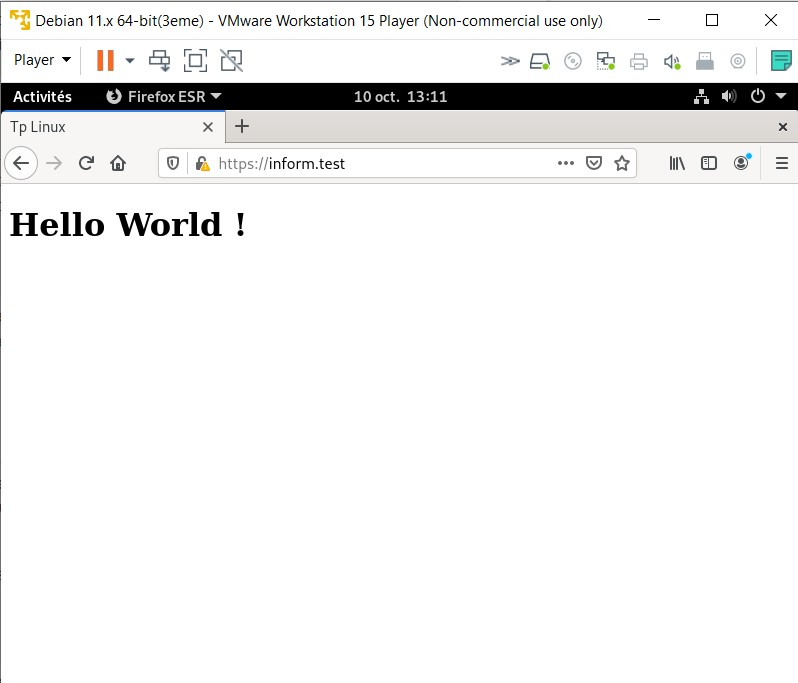
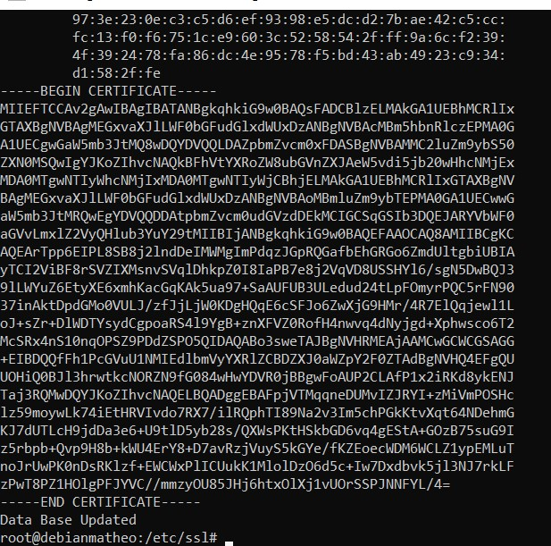

# :pager: Mettre en place un certificat SSL sur le site web

## Qu'est ce qu'un certificat SSL

La définition du certificat SSL se trouve [ici](./definition.md#certificat-ssl).

Un **certificat SSL** utilise un **système de cryptographie**.

Il utilise la cryptographie à clé publique, c'est-à-dire un système se basant sur 2 clés, une privée et une publique :

- La **clé publique** sert à **chiffrer** les données :
    Le site web se sert de la clé publique du serveur pour chiffrer les informations afin que personne (mise à part le serveur) ne puisse déchiffrer les données.

- La **clé privée** sert à **déchiffrer** les données :
    Le serveur va quant à lui utiliser la clé privée afin de déchiffrer les données reçues par le/les site(s) web(s).

Ce certificat va nous permettre d'utiliser le protocole **HTTPS** (*"S"* pour *Secure*) au lieu de **HTTP**.

Il y a plusieurs avantages à avoir ce certificat sur nos sites. Les 2 principales sont la **sécurité** et la **confiance**.

Afin de disposer d'un certificat SSL, il faut utiliser une autorité de certification, on va ici voir 2 méthodes pour avoir ce *certificat* :
- avec certification par un **tiers de confiance**.
- avec certification par nous même (**certificat auto-signé**).

> Dans la plupart des cas, pour configurer un serveur sécurisé utilisant le chiffrement par clé publique, vous envoyez votre demande de certificat (avec votre clé publique) à l'autorité de certification, accompagné d'une preuve de votre identité et de votre paiement. La CA vérifie votre identité et la demande de certificat, puis vous renvoie un certificat pour votre serveur sécurisé. Une alternative consiste a créer votre propre certificat auto-signé. - *[Guide Ubuntu](https://guide.ubuntu-fr.org/server/certificates-and-security.html)*

Avant de commencer à configurer un **certificat SSL**, il nous faut un **Vhost Apache** bien configuré (afin de pouvoir tester avec les 2 méthodes de mise en place du SSL).

----

### Mise en place d'un Vhost avec Apache

En effet, nous avons vu dans la section *[Installation d'Apache (et PHP)](./site-web.md#installation-dapache-(et-php))* que nous n'avions pas besoin de faire les **configurations d'un hôte virtuel** pour afficher notre site web. Malheureusement, nous en avons besoin pour mettre en place la **certification SSL**.


Donc il faut commencer par créer le fichier `.conf` correspondant à notre site web :

- On va dans le répertoire `/etc/apache2/sites-available/` :
    ```sh
    cd /etc/apache2/sites-available/
    ```

- On créé le fichier ``inform.conf`` :
    ```sh
    sudo nano inform.conf
    ```

- Nous allons y ajouter la configuration du Virtual Host :
    ```html
        <VirtualHost *:80>
            ServerName inform.test
            ServerAlias inform.test
                SSLCertificateFile /etc/ssl/certs/inform.test.crt
                SSLCertificateKeyFile /etc/ssl/private/inform.test.key
            ServerAdmin matheo.leger@ynov.com
            DocumentRoot /var/www/html/inform.test

            CustomLog ${APACHE_LOG_DIR}/inform.test-access.log combined
            ErrorLog ${APACHE_LOG_DIR}/inform.test.com-error.log

            <Directory /var/www/html/inform.test>
                Options All
                AllowOverride None
            </Directory>
        </VirtualHost>

        <VirtualHost *:443>
            ServerName inform.test
            ServerAlias inform.test
            ServerAdmin matheo.leger@ynov.com
            DocumentRoot /var/www/html/inform.test
                <Directory /var/www/html/inform.test>
                        Options All
                        AllowOverride None
                        Require all granted
                </Directory>

            # directives obligatoires pour TLS
            SSLEngine on
            SSLCertificateFile    /etc/ssl/certs/inform.test.crt
            SSLCertificateKeyFile   /etc/ssl/private/inform.test.key

            #Header always set Strict-Transport-Security "max-age=15768000"

            ErrorLog /var/log/apache2/error.example.com.log
            CustomLog /var/log/apache2/access.example.com.log combined
        </VirtualHost>
        
    ```

    Explication des éléments composants le ``.conf``
    - `*:80` : indique que le site web peut être utilisé sur le **port 80**.
    - `ServerName` : hôte pour lequel la configuration sera utilisée. Il n'y a qu'un seul **ServerName** possible par ``vhost``.
    - `ServerAlias` : Un ``vhost`` peut en avoir plusieurs.
    - `DocumentRoot` : On y met le chemin d'accès au fichier du site web.
    
    Il y a quelques informations supplémentaires pour un ``virtual host`` plus complet :
    
    - `ErrorLog` : Endroit où il faut enregistrer les logs d'erreurs.

    - `CustomLog` : Autres logs.


    :bulb: On met 2 *virtuals hosts* ici, ce qui va nous servir plus tard pour le SSL. En effet, le virtual host sur le **port 443**, est pour l'utilisation du protocole **HTTPS** (le port par défaut pour ce protocole est le **443**).  
    De plus, on a ajouté quelques lignes utiles pour activer le certificat :
    - `SSLEngine on` : Pour activer le **SSL**.
    - ``SSLCertificateFile`` : C'est le fichier contenant le certificat **signé**.
    - `SSLCertificateKeyFile` : C'est le fichier contenant la **clé privée** (celle pour déchiffrer).

- Une fois le fichier complété, on peut maintenant créer un dossier pour notre site :
    ```sh
    sudo mkdir /var/www/html/inform/
    ```
    Puis, dans notre cas, on va faire une copie du fichier index.html (configuré précédemment) :
    ```sh
    sudo cp /var/www/html/index.html /var/www/html/inform/
    ```

- Maintenant, il faut activer la configuration de l'hôte virtuel :
    ```sh
    sudo a2ensite inform
    ```

- Avant de redémarrer, on peut tester notre configuration :
    ```sh
    sudo apache2ctl -t
    ```
 
- Il ne reste plus qu'à redémarrer le service Apache :
    ```sh
    sudo systemctl reload apache2
    ```

Si tout fonctionne, on devrait avoir notre page qui apparaît dans le navigateur lorsque l'on écrit le nom de domaine.

----

## Configuration d'un certificat SSL avec Let's Encrypt
> :warning: Pour réaliser cette solution jusqu'au bout, il faut avoir un nom de domaine validé. En effet, **Let's Encrypt** est une autorité de certification. C'est-à-dire qu'elle va authentifier l'identité des correspondants. Si le nom de domaine n'est pas actif ou n'existe pas, alors Let's Encrypt ne donnera pas de validation pour le certificat. 

Pour commencer, il faut installer l'outil `certbot` de [Let's Encrypt](./definition.md#lets-encrypt).

> :bulb: Un programme de gestion de certificats en Python et sous licence Apache appelé ``certbot​`` s’installe sur le client (le serveur web d’un inscrit). - [Wikipédia](https://fr.wikipedia.org/wiki/Let%27s_Encrypt)

Cet outil va permettre de faire toute la gestion du certificat, il valide le domaine et configure d'autres choses (HTTPS, renouvellement du certificat, etc...).

Notre nom de domaine étant privé, on ne pourra pas faire la manipulation jusqu'au bout. En effet, **Let's Encrypt** à besoin d'un nom de domaine valide afin de créer un certificat SSL. (J'expliquerais en temps voulu, ce qu'il aurait fallut faire afin de finir la tâche)

Nous allons don commencer par télécharger le paquet `certbot`.

De nombreux tutoriels sur Internet, proposent des manières différentes de télécharger `certbot`. Nous allons ici, utiliser la **méthode officielle** du [site de certbot](https://certbot.eff.org/lets-encrypt/debianbuster-apache.html) pour l'installer sur notre machine sous **Debian 11**.


Tout d'abord, nous devons installer le gestionnaire de paquet [Snap](./definition.md#Snap). Pour ce faire, nous allons installer `snapd` via la commande :

```sh
sudo apt-get install snapd
```



Une fois l'outil installé, il faut installer la dernière version du `core snap` (cœur du logiciel) pour avoir la dernière version de ``snapd`` :

```sh
sudo snap install core
```

Après quelques temps d'attente, on devrait avoir le message :

```sh
core 16-2.45.2 from Canonical✓ installed
```

Si jamais il était déjà installé, on peut faire la commande `sudo snap refresh core` afin d'avoir la dernière version du logiciel.

Avant de continuer, le site de `certbot` recommande de supprimer toutes versions, potentiellement existantes, de `certbot` :

```sh
sudo apt-get remove certbot
```

On peut maintenant passer à l'installation de `certbot` :

```sh
sudo snap install --classic certbot
```

Une fois installer, pour que le nom `certbot` soit reconnu comme une commande, il faut taper la ligne suivante dans le terminal :

```sh
sudo ln -s /snap/bin/certbot /usr/bin/certbot
```

Avant de commencer à faire les commandes liés à `certbot`, on doit activer 2 modes sur les services ``apache`` :

- le module **SSL**.
- le module **rewrite**.

Pour vérifier s'ils sont déjà installés :

```sh
sudo apachectl -M
```
Si dans les modules, il y a les 2, alors il n'y a rien à faire de plus. Personnellement, je ne les avais pas :



Il faut donc les installer respectivement avec les lignes :

```sh
sudo a2enmod ssl

sudo a2enmod rewrite
```





Il faut maintenant relancer les services Apache :

```sh
sudo systemctl reload apache2
```

Afin d'avoir un certificat, il faut utiliser le système de **vhost** d'*Apache* : Nous allons donc devoir **reconfigurer** notre site web.

On peut maintenant utiliser `certbot` :

C'est à ce moment-là que l'on ne peut plus avancer si on n'a pas un nom de domaine valide.

En effet, il faut que notre nom de domaine soit bien composé d'un **TLD** (Top level domain) et d'un **SLD** (Secondary Level domain). Et il faut qu'il soit **reconnu comme actif** (il faut l'avoir acheté).

Il y a plusieurs façon d'utiliser ``certbot`` :

- Pour une configuration **automatique** :
    
    ```sh
    sudo certbot --apache
    ```
    Cette commande va vous configurer votre ``virtualHost`` automatiquement :

    

    (Sur l'image ci-dessus, j'avais modifié le nom de domaine par inform.test afin de voir si cela fonctionnait quand on utilisait un nom de domaine composé d'un TLD et d'un SLD)

    Une fois ceci fait, le certificat devrait être créé et configuré automatiquement.

- Pour une configuration "**semi-automatique**" (on donne directement le nom de domaine) :

    ```sh
    sudo certbot --apache -d inform.test -d www.inform.test
    ```

    (Là encore j'avais changé le nom de domaine) 

- Pour une configuration **manuelle** :
    ```sh
    sudo certbot certonly --webroot --webroot-path /var/www/html/inform/ --domain inform.test --email matheoleger@ynov.com
    ```

    Il y a pas mal de configuration à faire dans le fichier du ``vhost``, on peut suivre ce [lien](https://www.memoinfo.fr/tutoriels-linux/configurer-lets-encrypt-apache/) pour le faire.


On peut maintenant **tester** notre **configuration** et **redémarrer** :

```sh
apache2ctl -t
systemctl reload apache2
```

On peut maintenant **tester** le certificat SSL en essayant d'accéder au site avec le **protocole HTTPS**.

On peut aussi utiliser un site de **test de validité** du certificat.

***À noter :*** Let's Encrypt expire au bout de 90 jours, il faut donc faire la commande :

```sh
certbot renew --dry-run
```

On peut donc faire un système CRON (voir [TP n°1](../TP-1/definition.md#crontab)) qui tous les 90 jours va réinitialiser notre certificat SSL.

## Configuration d'un certificat SSL auto-signé avec OpenSSL.

> :link: La documentation m'ayant permis de faire cette partie : https://guide.ubuntu-fr.org/server/certificates-and-security.html

Ici, le principe est d'avoir un **certificat SSL** dit auto-signé. Ce certificat nous permettra d'accéder au protocole HTTPS. En revanche, il se peut qu'il faille, pour certains navigateurs, préciser que ce site est sécurisé.

Dans un cadre de production, il sera préférable d'utiliser une **CA** (Certificate Authority) pour valider le **certificat**.

Il peut donc être intéressant de créer notre propre **autorité de certification**.

Tout d'abord, on va générer une demande de signature de certificat, dit CSR (Certificate Signing Request).

On va commencer par générer une clé avec puis sans "*phrase de passe*".

On exécute la commande suivante :

```sh
openssl genrsa -des3 -out inform.test.key 2048
```



Comme vu ci-dessus, on vient de générer une clé, voici le détail de la commande :

- `genrsa` : Permet la génération d'une clé.
- `des3` : algorithme de chiffrement nommé **Triple DES**. Voir les détails [ici](https://fr.wikipedia.org/wiki/Triple_DES)
- `-out inform.test.key 2048` : sauvegarder une clé de 2048 bits dans le fichier ``inform.test.key``.

>:bulb: L'Algorithme de chiffrement **Triple DES**, demande une phrase de passe d'au minimum **4 caractères**.

On génère à présent la clé non sécurisée :

```sh
openssl rsa -in inform.test.key -out inform.test.key.insecure
```

>:bulb: L'avantage de générer cette clé, c'est qu'elle va permettre de redémarrer les services, sans avoir besoin de redonner le mot de passe, ce qui est pratique pour notre TP, car nous avons juste besoin de montrer que ça marche. (Le problème est au niveau de la sécurité).

Une fois, les 2 clés générées, alors on échange les noms :

```sh
mv inform.test.key inform.test.key.secure
mv inform.test.key.insecure inform.test.key
```

Maintenant, notre clé sera celle non sécurisée.

On peut donc à présent, générer notre **CSR** (demande de signature de certificat) :

```sh
openssl req -new -key inform.test.key -out inform.test.csr
```

Voici les détails de la commande ci-dessus :
- `req -new` : pour générer une **CSR**.
- `-key inform.test.key` : On spécifie la clé utilisée.
- `-out inform.test.csr` : On spécifie le fichier de sortie.

Voici une image du résumé des commandes ci-dessus :



Une fois la phrase de passe renseignée, il vous sera demandé des renseignements sur le certificat, comme le nom de l'entreprise, la ville, le pays etc...

Il faut maintenant créer le **certificat auto-signé**. Pour ce faire, on utilise la commande :

```sh
openssl x509 -req -days 365 -in inform.test.csr -signkey inform.test.key -out inform.test.crt
```

Voici que que fait la commande :

- ``x509`` : **X.509** est une **norme** pour les **certificats**.
- `-req` : Pour créer le certificat *auto-signé*.
- `-days 365` : Le certificat est valable 365 jours.
- `-in inform.test.csr` : Va chercher le fichier de **demande de signature de certificat**.
- `-signkey inform.test.key` : On utilise la clé générée précédemment.
- `-out inform.test.crt` : Fichier dans lequel on va mettre ce certificat.

Maintenant que l'on a généré notre propre certificat auto-signé, il ne reste plus qu'à l'appliquer. Pour ce faire, on va placer dans les dossiers par défaut de **SSL** (afin de retrouver notre certificat plus rapidement) :

```sh
sudo cp inform.test.crt /etc/ssl/certs
sudo cp inform.test.key /etc/ssl/private
```
Une fois ceci fait, alors il ne reste plus qu'à configurer le SSL pour les outils que l'on utilise. Dans notre cas, il faut configurer notre serveur Apache :

Pour ce faire, on change le fichier de configuration du virtual host correspondant à notre site web :

```sh
sudo nano /etc/apache2/sites-available/inform.test.conf
```

Si on ne l'avait pas fait précédemment, on vérifie qu'il y a bien ces lignes dans le **virtual host** :
```html
<VirtualHost *:443>
    {...}
    # directives obligatoires pour TLS
    SSLEngine on
    SSLCertificateFile    /etc/ssl/certs/inform.test.crt
    SSLCertificateKeyFile   /etc/ssl/private/inform.test.key
    {...}
</VirtualHost>
```

Pour l'explication, voir plus haut dans la partie [Mise en place d'un Vhost avec Apache](./ssl.md#Mise-en-place-dun-Vhost-avec-Apache).

On vérifie aussi que le module SSL est activé. On utilise la commande suivante pour l'activer : 

```sh
sudo a2ensite ssl
```

On redémarre le service Apache :

```sh
sudo systemctl restart apache2
```

Et normalement si on tape l'adresse dans le navigateur, on obtient :



On peut voir qu'on est bien en **https** :


On remarque toutefois, une vigilance de notre navigateur sur la confiance de notre site. En effet, on utilise un certificat **auto-signé**. On pourrait donc le faire signer par une **CA**.

Dans cette partie du TP, j'ai mis en place une autorité de certification. Malheureusement par manque de temps, je ne peux pas le détailler ici.

### Voici en grande ligne comment il aurait fallu faire :

On commence par créer les répertoires nécessaires :

```sh
sudo mkdir /etc/ssl/CA
sudo mkdir /etc/ssl/newcerts
```

On créé quelques fichiers permettant :
- De garder une trace du dernier numéro de série utilisé par notre **AC** : 
    ```sh
    sudo sh -c "echo '01' > /etc/ssl/CA/serial"
    ```
- De garder une trace des certificats générés :
    ```sh
    sudo touch /etc/ssl/CA/index.txt
    ```

Il faut aussi modifier les paramètres de l'AC dans le fichier `/etc/ssl/openssl.conf` :

```sh
dir             = /etc/ssl              # Where everything is kept
database        = $dir/CA/index.txt     # database index file.
certificate     = $dir/certs/cacert.pem # The CA certificate
serial          = $dir/CA/serial        # The current serial number
private_key     = $dir/private/cakey.pem# The private key
```

Cela permettra de configurer plusieurs certificats, plus rapidement.

Ensuite, on génère le **certificat lié à l'AC**, qui sera le **certficat racine** (*root certificate*) :

```sh
openssl req -new -x509 -extensions v3_ca -keyout cakey.pem -out cacert.pem -days 3650
```

On installe donc le certificat racine et la clé de l'AC :

```sh
sudo mv cakey.pem /etc/ssl/private/
sudo mv cacert.pem /etc/ssl/certs/
```

Tout est donc bien configuré, il ne manque plus qu'à signer des certificats grâce à la ligne :

```sh
sudo openssl ca -in <nom de la CSR> -config /etc/ssl/openssl.cnf
```
(Il faut avoir généré une CSR)

On peut maintenant récupérer le **certificat** dans le fichier **01.pem** (pour les prochains, ce sera 02.pem, 03.pem etc...).

On copie le contenu de ce fichier (allant de BEGIN CERTIFICATE à END CERTIFICATE) et on le place dans un fichier `.crt` portant le nom que l'on veut.




Voici donc comment on a créé notre propre certificat.

--------------------------------------------------------

## :chart_with_upwards_trend: Axes d'améliorations

Dans le cas d'un test professionnel, il faudrait essayer avec un nom de domaine valide (même si ce n'est pas le bon, tester avec un nom de domaine ayant un TLD et un SLD).

 Voici les commentaires que l'on peut faire, si notre but était de faire une solution dans un environnement professionnel :
- L'utilisation d'un certificat auto-signé est peu recommandé
- On peut créer notre propre **CA** quand on a plusieurs certificats à signer.
- On peut utiliser un certificat signé par une vraie **CA**, ce qui fait que nos sites seront reconnus comme sécurisés.

----

[<--- Configuration d'un nom de domaine pour le site web](./nom-domaine.md) | Page 4 | [ Configuration d'un service de Haute Disponibilité --->](./haute-dispo.md)


